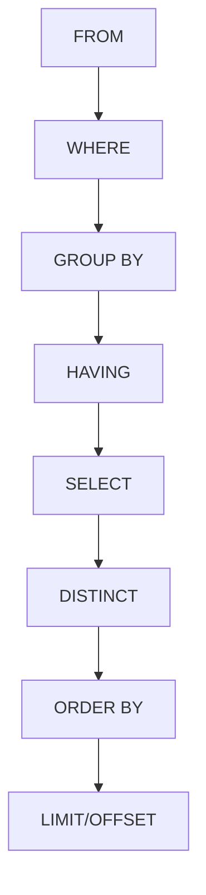

#HCMUS 
#PostgreSQL
#SQL


# Thông tin kì thi

Phòng thi: E404 (NVC)
Thời gian: 10/07/2024 - 13h30


# 1. Tổng quan về Cơ sở Dữ liệu (Database)

#ER-Model
#Database

![[Pasted image 20240706172458.png]]

Dữ liệu --> Thông tin --> Tri thức --> Quyết định -->| Dữ liệu

![[Pasted image 20240706172606.png]]

![[Pasted image 20240706172633.png]]


**Cơ sở dữ liệu** (Database - DB) là tập hợp có tổ chức của các dữ liệu được lưu trữ

![[Pasted image 20240706172811.png]]

**Hệ quản trị cơ sở dữ liệu** (Database Management System - DBMS) là hệ thống phần mềm giúp người dùng thực hiện các thao tác với CSDL

![[Pasted image 20240706172910.png]]

## 1.1. Mô hình thực thể kết hợp - ER Model

**Entity-relationship model (ER Model)** là mô hình biểu diễn mối quan hệ giữa các thực thể khác nhau
- Gồm các loại **thực thể (entity)**, các **thuộc tính (attribute)** và các mối **quan hệ (relationship)**
- Có thể được biểu diễn bằng các sơ đồ thực thể kết hợp (Entity-relationship diagram - ERD)
Bằng việc sử dụng mô hình ER, có thể dễ dàng đặc tả được mối quan hệ giữa các thực thể ngòai đời thực, từ đó thiết kế các CSDL quan hệ phù hợp để lưu trữ dữ liệu

![[Pasted image 20240706173335.png]]

![[Pasted image 20240706173353.png]]


## 1.2. Mô hình dữ liệu quan hệ

Bảng (relation) tương đương với mỗi hình chữ nhật (entity) trong ERD (Entity
Relationship Datagram).
- Trong mỗi bảng sẽ có nhiều cột (column/attribute). Các cột này tương đương với hình oval (cũng gọi là attribute) trong ERD.
- Mỗi dòng (tuple/record/row) trong một bảng theo lý thuyết phải có giá trị unique.(nhưng trong thực tế nó có thể bị lặp lại do sai sót)

![[Pasted image 20240706174009.png]]

**Primary key**: Mỗi bảng có một cột Primary Key. Đây là cột để định danh duy nhất
mỗi record trong table của cơ sở dữ liệu, cột này không được chứa null value

**Foreign key**: là cột được ghi chú (FK) ở bảng này, và là cột Primary Key ở bảng khác. Dùng để kết nối bảng này với bảng khác - là khái niệm cốt lõi của Relational database.

Ví dụ: ![[Pasted image 20240706174201.png]]

## 1.3. Tại sao database quan trọng

1. Easier to manage data
2. Improved data sharing
3. Improved data security
4. Better enforce data quantity


# 2. PostgreSQL

#PostgreSQL 

![[NoiDungOnThi.jpg]]
## 2.1. **Thao tác với Database**

Các thao tác thường gặp với cơ sở dữ liệu (database) trong PostgreSQL bao gồm quản lý cơ sở dữ liệu, bảng, và các thành phần liên quan. Dưới đây là một số thao tác phổ biến:

### 1. **Tạo và Xóa Cơ Sở Dữ Liệu**

**Tạo cơ sở dữ liệu:**

```sql
CREATE DATABASE database_name;
```

**Xóa cơ sở dữ liệu:**

```sql
DROP DATABASE database_name;
```

### 2. **Kết Nối và Ngắt Kết Nối với Cơ Sở Dữ Liệu**

**Kết nối với cơ sở dữ liệu:**

```sql
\c database_name;
```

**Ngắt kết nối với cơ sở dữ liệu:**

```sql
\q
```

### 3. **Tạo và Xóa Bảng**

**Tạo bảng:**

```sql
CREATE TABLE table_name (
    column1 datatype PRIMARY KEY,
    column2 datatype,
    column3 datatype
);
```

**Xóa bảng:**

```sql
DROP TABLE table_name;
```

### 4. **Thêm, Cập Nhật và Xóa Cột**

**Thêm cột:**

```sql
ALTER TABLE table_name
ADD COLUMN column_name datatype;
```

**Cập nhật cột:**

```sql
ALTER TABLE table_name
ALTER COLUMN column_name SET DATA TYPE new_datatype;
```

**Xóa cột:**

```sql
ALTER TABLE table_name
DROP COLUMN column_name;
```

### 5. **Thêm, Cập Nhật và Xóa Index**

**Thêm index:**

```sql
CREATE INDEX index_name
ON table_name (column_name);
```

**Xóa index:**

```sql
DROP INDEX index_name;
```

### 6. **Quản Lý Người Dùng và Quyền**

**Tạo người dùng:**

```sql
CREATE USER username WITH PASSWORD 'password';
```

**Gán quyền cho người dùng:**

```sql
GRANT privilege_name ON database_name TO username;
```

**Thu hồi quyền từ người dùng:**

```sql
REVOKE privilege_name ON database_name FROM username;
```

**Xóa người dùng:**

```sql
DROP USER username;
```

### 7. **Sao Lưu và Phục Hồi Dữ Liệu**

**Sao lưu dữ liệu:**

```sh
pg_dump database_name > backup_file.sql
```

**Phục hồi dữ liệu:**

```sh
psql database_name < backup_file.sql
```

### 8. **Tạo và Quản Lý Khóa Ngoại (Foreign Key)**

**Tạo khóa ngoại:**

```sql
ALTER TABLE child_table
ADD CONSTRAINT fk_name
FOREIGN KEY (column_name)
REFERENCES parent_table (column_name);
```

**Xóa khóa ngoại:**

```sql
ALTER TABLE child_table
DROP CONSTRAINT fk_name;
```

## 2.2. **Thiết kế Database**

**Bước 1: Xác định mục đích lưu trữ dữ liệu.**

Ví dụ: Dữ liệu lưu trữ giao dịch của khách hàng

**Bước 2: Liệt kê các thông tin dữ liệu lưu trữ theo dạng "đối tượng" (objects): **

Ví dụ: Product, Customer, Payment method, ...

**Bước 3: Liệt kê và xác định các thuộc tính (attributes) của đối tượng. **

Ví dụ: 
1. Product: tên sản phẩm, khối lượng, giá,..., 
2. Customer: họ, tên, email, ...
3. ....

**Bước 4: Xác định xem mối quan hệ giữa các bảng là gì (One-One, One-Many, Many-One, Many-Many)**

Ví dụ: "Một sản phẩm có nhiều người bán", "Một sản phẩm có nhiều khách hàng", ...

**Bước 5: Lựa chọn mã định danh (ID) - thường là primary key**

Ví dụ:
1. Product: product_id
2. Customer: customer_id
3. ...

**Bước 6: Liên kết các bảng bằng các ID - xây dựng khóa ngoại**


## 2.3. **CRUD**

#CRUD

CRUD là viết tắt của các thao tác cơ bản trong cơ sở dữ liệu: Create (Tạo), Read (Đọc), Update (Cập nhật), và Delete (Xóa). Dưới đây là cách thực hiện các thao tác CRUD trong PostgreSQL:

### 1. **Create (Tạo)**

Để thêm dữ liệu mới vào bảng, chúng ta sử dụng câu lệnh `INSERT INTO`.

**Cú pháp:**

```sql
INSERT INTO table_name (column1, column2, ...)
VALUES (value1, value2, ...);
```

**Ví dụ:**

Giả sử bạn có một bảng tên là `employees` với các cột `id`, `name`, và `position`. Để thêm một nhân viên mới, bạn sử dụng:

```sql
INSERT INTO employees (id, name, position)
VALUES (1, 'John Doe', 'Software Engineer');
```

### 2. **Read (Đọc)**

Để đọc dữ liệu từ bảng, chúng ta sử dụng câu lệnh `SELECT`.

**Cú pháp:**

```sql
SELECT column1, column2, ...
FROM table_name
WHERE condition;
```

**Ví dụ:**

Để đọc tất cả các dữ liệu từ bảng `employees`:

```sql
SELECT * FROM employees;
```

Để đọc các dữ liệu cụ thể:

```sql
SELECT name, position FROM employees WHERE id = 1;
```

### 3. **Update (Cập nhật)**

Để cập nhật dữ liệu trong bảng, chúng ta sử dụng câu lệnh `UPDATE`.

**Cú pháp:**

```sql
UPDATE table_name
SET column1 = value1, column2 = value2, ...
WHERE condition;
```

**Ví dụ:**

Để cập nhật vị trí công việc của nhân viên có `id` là 1:

```sql
UPDATE employees
SET position = 'Senior Software Engineer'
WHERE id = 1;
```

### 4. **Delete (Xóa)**

Để xóa dữ liệu khỏi bảng, chúng ta sử dụng câu lệnh `DELETE`.

**Cú pháp:**

```sql
DELETE FROM table_name
WHERE condition;
```

**Ví dụ:**

Để xóa nhân viên có `id` là 1:

```sql
DELETE FROM employees
WHERE id = 1;
```

### 5. **Import CSV File to Database**

Sử dụng lệnh copy

```SQL
COPY table_name
FROM source
DELIMITER ','
CSV header;
```

## 2.4. **Data Types**

Trong PostgreSQL, có nhiều loại dữ liệu (data types) được sử dụng để lưu trữ các loại thông tin khác nhau. Dưới đây là các loại dữ liệu phổ biến:

### 1. **Số nguyên (Integer Types)**

- `smallint`: Số nguyên nhỏ, từ -32,768 đến 32,767.
- `integer` hoặc `int`: Số nguyên, từ -2,147,483,648 đến 2,147,483,647.
- `bigint`: Số nguyên lớn, từ -9,223,372,036,854,775,808 đến 9,223,372,036,854,775,807.
- `serial` và `bigserial`: Tự động tăng số nguyên (auto-incrementing).

### 2. **Số thực (Floating-Point Types)**

- `real`: Số thực với độ chính xác đơn (single precision).
- `double precision`: Số thực với độ chính xác kép (double precision).
- `numeric` hoặc `decimal`: Số thập phân với độ chính xác tùy ý (arbitrary precision).

### 3. **Ký tự (Character Types)**

- `char(n)`: Chuỗi ký tự cố định độ dài.
- `varchar(n)`: Chuỗi ký tự biến đổi độ dài với giới hạn.
- `text`: Chuỗi ký tự biến đổi độ dài không giới hạn.

### 4. **Boolean**

- `boolean`: Giá trị logic đúng (TRUE) hoặc sai (FALSE).

### 5. **Ngày và giờ (Date/Time Types)**

- `date`: Ngày (không có thời gian).
- `time [ (p) ] [ without time zone ]`: Thời gian trong ngày (không có múi giờ).
- `time [ (p) ] with time zone`: Thời gian trong ngày (có múi giờ).
- `timestamp [ (p) ] [ without time zone ]`: Ngày và giờ (không có múi giờ).
- `timestamp [ (p) ] with time zone`: Ngày và giờ (có múi giờ).
- `interval`: Khoảng thời gian.

### 6. **Dữ liệu kiểu hình học (Geometric Types)**

- `point`: Điểm (x, y).
- `line`: Đường vô hạn.
- `lseg`: Đoạn thẳng.
- `box`: Hình hộp chữ nhật.
- `path`: Đường dẫn.
- `polygon`: Đa giác.
- `circle`: Hình tròn.

### 7. **Dữ liệu kiểu mạng (Network Address Types)**

- `cidr`: Khối địa chỉ IP.
- `inet`: Địa chỉ IP.
- `macaddr`: Địa chỉ MAC.

### 8. **Dữ liệu kiểu bit (Bit String Types)**

- `bit [ (n) ]`: Chuỗi bit cố định độ dài.
- `bit varying [ (n) ]`: Chuỗi bit biến đổi độ dài.

### 9. **Dữ liệu kiểu tiền tệ (Monetary Types)**

- `money`: Số tiền tệ.

### 10. **Dữ liệu kiểu mảng (Array Types)**

- `type[]`: Mảng của bất kỳ loại dữ liệu nào.

### 11. **Dữ liệu kiểu JSON (JSON Types)**

- `json`: Dữ liệu JSON.
- `jsonb`: Dữ liệu JSON nhị phân (binary).

### 12. **Dữ liệu kiểu XML (XML Type)**

- `xml`: Dữ liệu XML.

### 13. **Dữ liệu kiểu UUID (UUID Type)**

- `uuid`: Định danh duy nhất toàn cầu.

### 14. **Dữ liệu kiểu HSTORE (HSTORE Type)**

- `hstore`: Cặp key-value.

### 15. **Dữ liệu kiểu composite (Composite Types)**

- Composite type là kiểu dữ liệu được tạo từ các kiểu dữ liệu khác.

### 16. **Dữ liệu kiểu phạm vi (Range Types)**

- `int4range`: Phạm vi số nguyên 32-bit.
- `int8range`: Phạm vi số nguyên 64-bit.
- `numrange`: Phạm vi số thực.
- `tsrange`: Phạm vi timestamp không có múi giờ.
- `tstzrange`: Phạm vi timestamp có múi giờ.
- `daterange`: Phạm vi ngày.

### Ví dụ sử dụng các loại dữ liệu

```sql
CREATE TABLE example (
	id serial     PRIMARY KEY,
    name          varchar(100),
    age           integer,
    salary        numeric(10, 2),
    is_active     boolean,
    created_at    timestamp with time zone,
    data          jsonb
);
```

## 2.5. **Inheritance**

#Inheritance

Như trong OOP, Inheritance là tính kế thừa giữa hai table với nhau. 

```sql
CREATE TABLE cities (
	name            text,
	population      float,
	elevation       int  --in feet
);

CREATE TABLE capitals (
	state           char(2)
) INHERITS (cities);
```

Khi truy vấn thông thường 
```sql
SELECT name, elevation 
FROM cities 
WHERE elevation > 500;
```

| **name**  | **elevation** |
| --------- | ------------- |
| Las Vegas | 2174          |
| Mariposa  | 1953          |
| Madison   | 845           |

Kết quả sẽ truy vấn kết quả của các table con của `cities` (`capitals`). Nếu muốn chỉ truy vấn các thành phố không phải `capitals` (tức chỉ truy vấn trong `cities`)

```sql
SELECT name, elevation 
FROM ONLY cities 
WHERE elevation > 500;
```

| **name**  | **elevation** |
| --------- | ------------- |
| Las Vegas | 2174          |
| Mariposa  | 1953          |
**Note:** `ONLY` chỉ support cho `SELECT, UPDATE, DELETE` , tức các keyword khác như `INSERT, ...`  không dùng `ONLY`


Khi muốn biết row nào thuộc về table nào thì

```sql
SELECT p.relname, c.name, c.elevation 
FROM cities c, pg_class p 
WHERE c.elevation > 500 AND c.tableoid = p.oid;
```

| relname  | name      | elevation |
| -------- | --------- | --------- |
| cities   | Las Vegas | 2174      |
| cities   | Mariposa  | 1953      |
| capitals | Madison   | 845       |

## 2.6. **Table Partition**

#TablePartition

Table partitioning là một kỹ thuật giúp cải thiện hiệu suất truy vấn và quản lý dữ liệu bằng cách **chia một bảng lớn thành nhiều bảng nhỏ hơn**, được gọi là "partitions" (phân vùng). 

Mỗi phân vùng chứa một phần dữ liệu của bảng chính và được lưu trữ riêng biệt. Đây là một cách hiệu quả để quản lý và tối ưu hóa các bảng có kích thước lớn.

### Các loại phân vùng

1. **Range Partitioning** (Phân vùng theo phạm vi)
   - Dữ liệu được chia thành các phân vùng dựa trên một phạm vi giá trị của cột.
   - Ví dụ: Phân vùng theo ngày, tháng hoặc năm.

```sql
CREATE TABLE sales (
	id serial PRIMARY KEY,
	sale_date date,
	amount numeric
) PARTITION BY RANGE (sale_date);

CREATE TABLE sales_2023 PARTITION OF sales
FOR VALUES FROM ('2023-01-01') TO ('2024-01-01');
```

2. **List Partitioning** (Phân vùng theo danh sách)
   - Dữ liệu được chia thành các phân vùng dựa trên các giá trị cụ thể của cột.
   - Ví dụ: Phân vùng theo quốc gia hoặc trạng thái.

```sql
CREATE TABLE customer_data (
	id serial PRIMARY KEY,
	country text,
	name text
) PARTITION BY LIST (country);

CREATE TABLE customer_data_usa PARTITION OF customer_data
FOR VALUES IN ('USA');

CREATE TABLE customer_data_canada PARTITION OF customer_data
FOR VALUES IN ('Canada');
```

3. **Hash Partitioning** (Phân vùng theo hàm băm)
   - Dữ liệu được chia thành các phân vùng dựa trên hàm băm của cột.
   - Phân vùng này giúp phân bổ dữ liệu đồng đều hơn.

```sql
CREATE TABLE orders (
	id serial PRIMARY KEY,
	customer_id int,
	order_date date
) PARTITION BY HASH (customer_id);

CREATE TABLE orders_p0 PARTITION OF orders
FOR VALUES WITH (MODULUS 4, REMAINDER 0);

CREATE TABLE orders_p1 PARTITION OF orders
FOR VALUES WITH (MODULUS 4, REMAINDER 1);
```

4. **Composite Partitioning** (Phân vùng kết hợp)
   - Kết hợp nhiều loại phân vùng với nhau.
   - Ví dụ: Phân vùng theo phạm vi và sau đó phân vùng theo danh sách.

```sql
CREATE TABLE logs (
	id serial PRIMARY KEY,
	log_date date,
	severity text
) PARTITION BY RANGE (log_date);

CREATE TABLE logs_2023 PARTITION OF logs
FOR VALUES FROM ('2023-01-01') TO ('2024-01-01')
PARTITION BY LIST (severity);

CREATE TABLE logs_2023_info PARTITION OF logs_2023
FOR VALUES IN ('INFO');

CREATE TABLE logs_2023_error PARTITION OF logs_2023
FOR VALUES IN ('ERROR');
```

### Ví dụ thực tế về Table Partitioning

Giả sử bạn có một bảng `transactions` chứa dữ liệu giao dịch của nhiều năm. Bạn muốn phân vùng bảng này theo năm 
```sql
CREATE TABLE transactions (
    id serial PRIMARY KEY,
    transaction_date date,
    amount numeric
) PARTITION BY RANGE (transaction_date);

CREATE TABLE transactions_2022 PARTITION OF transactions
FOR VALUES FROM ('2022-01-01') TO ('2023-01-01');

CREATE TABLE transactions_2023 PARTITION OF transactions
FOR VALUES FROM ('2023-01-01') TO ('2024-01-01');
```

## 2.7. **Thứ tự thực hiện trong Query**

#Query

Giả sử ta có một truy vấn (full) như sau:

```sql
SELECT department_id, SUM(salary) AS total_salary
FROM employees
WHERE salary > 45000
GROUP BY department_id
HAVING SUM(salary) > 100000
ORDER BY total_salary DESC
LIMIT 1;
```

Thì thứ tự thực hiện như sau:



## 2.8. **JOIN**

#Query/Join

### 1. **INNER JOIN**

- **Mô tả:** Trả về các hàng khi có ít nhất một kết quả khớp nhau trong cả hai bảng.
- **Ví dụ:**

```sql
SELECT *
FROM A
INNER JOIN B
ON A.id = B.id;
```

### 2. **LEFT JOIN (LEFT OUTER JOIN)**

- **Mô tả:** Trả về tất cả các hàng từ bảng bên trái, và các hàng khớp nhau từ bảng bên phải. Nếu không có hàng khớp ở bảng bên phải, kết quả sẽ chứa giá trị NULL.
- **Ví dụ:**

```sql
SELECT *
FROM A
LEFT JOIN B
ON A.id = B.id;
```

### 3. **RIGHT JOIN (RIGHT OUTER JOIN)**

- **Mô tả:** Trả về tất cả các hàng từ bảng bên phải, và các hàng khớp nhau từ bảng bên trái. Nếu không có hàng khớp ở bảng bên trái, kết quả sẽ chứa giá trị NULL.
- **Ví dụ:**

```sql
SELECT *
FROM A
RIGHT JOIN B
ON A.id = B.id;
```

### 4. **FULL OUTER JOIN**

- **Mô tả:** Trả về tất cả các hàng khi có kết quả khớp nhau trong cả hai bảng hoặc không khớp. Kết quả sẽ chứa giá trị NULL nếu không có hàng khớp.
- **Ví dụ:**

```sql
SELECT *
FROM A
FULL OUTER JOIN B
ON A.id = B.id;
```

### 5. **CROSS JOIN**

- **Mô tả:** Trả về tích Cartesian của hai bảng. Mỗi hàng trong bảng đầu tiên sẽ kết hợp với mỗi hàng trong bảng thứ hai.
- **Ví dụ:**

```sql
SELECT *
FROM A
CROSS JOIN B;
```

### Bảng Minh Họa

Giả sử chúng ta có hai bảng `A` và `B`:

**Bảng A:**

| id  | name_A  |
|-----|---------|
| 1   | Alice   |
| 2   | Bob     |
| 3   | Charlie |

**Bảng B:**

| id  | name_B  |
|-----|---------|
| 2   | Delta   |
| 3   | Echo    |
| 4   | Foxtrot |

### Kết quả JOIN

**INNER JOIN:**

| id  | name_A  | name_B |
|-----|---------|--------|
| 2   | Bob     | Delta  |
| 3   | Charlie | Echo   |

**LEFT JOIN:**

| id  | name_A  | name_B |
|-----|---------|--------|
| 1   | Alice   | NULL   |
| 2   | Bob     | Delta  |
| 3   | Charlie | Echo   |

**RIGHT JOIN:**

| id  | name_A  | name_B |
|-----|---------|--------|
| 2   | Bob     | Delta  |
| 3   | Charlie | Echo   |
| 4   | NULL    | Foxtrot|

**FULL OUTER JOIN:**

| id  | name_A  | name_B |
|-----|---------|--------|
| 1   | Alice   | NULL   |
| 2   | Bob     | Delta  |
| 3   | Charlie | Echo   |
| 4   | NULL    | Foxtrot|

**CROSS JOIN:**

| id_A | name_A  | id_B | name_B |
|------|---------|------|--------|
| 1    | Alice   | 2    | Delta  |
| 1    | Alice   | 3    | Echo   |
| 1    | Alice   | 4    | Foxtrot|
| 2    | Bob     | 2    | Delta  |
| 2    | Bob     | 3    | Echo   |
| 2    | Bob     | 4    | Foxtrot|
| 3    | Charlie | 2    | Delta  |
| 3    | Charlie | 3    | Echo   |
| 3    | Charlie | 4    | Foxtrot|

### Tổng kết

- **INNER JOIN:** Chỉ lấy các hàng có kết quả khớp nhau ở cả hai bảng.
- **LEFT JOIN:** Lấy tất cả các hàng từ bảng trái, và các hàng khớp từ bảng phải.
- **RIGHT JOIN:** Lấy tất cả các hàng từ bảng phải, và các hàng khớp từ bảng trái.
- **FULL OUTER JOIN:** Lấy tất cả các hàng có hoặc không có kết quả khớp từ cả hai bảng.
- **CROSS JOIN:** Lấy tất cả các kết hợp của các hàng từ cả hai bảng.

## 2.9. **Window Functions**

#WindowFunction

Window functions cho phép bạn thực hiện các phép tính trên các nhóm hàng liên quan đến hàng hiện tại mà không cần phải nhóm các hàng này lại với nhau như trong các hàm tổng hợp (aggregate functions). 

### Khái niệm cơ bản về Window Functions

Window functions hoạt động trên một tập hợp các hàng được gọi là "cửa sổ" (window) và trả về một giá trị cho mỗi hàng trong cửa sổ đó. Cửa sổ này được xác định bởi mệnh đề `OVER` trong câu lệnh SQL.

### Các phần chính của Window Function

1. **PARTITION BY**: Chia tập hợp kết quả thành các nhóm (partitions) mà window function sẽ áp dụng lên.
2. **ORDER BY**: Xác định thứ tự của các hàng trong mỗi partition.
3. **Window Frame**: Xác định phạm vi của các hàng trong mỗi partition mà window function sẽ tính toán.

### Cú pháp cơ bản của Window Function

```sql
<window_function> OVER (
    [PARTITION BY <partition_columns>]
    [ORDER BY <order_columns>]
    [ROWS or RANGE <window_frame>]
)
```

### Các loại Window Functions phổ biến

1. **Aggregate Window Functions**: Các hàm tổng hợp được sử dụng như window functions.
   - `SUM()`
   - `AVG()`
   - `COUNT()`
   - `MIN()`
   - `MAX()`

2. **Ranking Functions**: Các hàm xếp hạng.
   - `ROW_NUMBER()`: Trả về số thứ tự của mỗi hàng trong cửa sổ.
   - `RANK()`: Trả về thứ hạng của mỗi hàng trong cửa sổ. Hàng có cùng giá trị sẽ có cùng thứ hạng.
   - `DENSE_RANK()`: Tương tự `RANK()`, nhưng không có khoảng cách trong thứ hạng.
   - `NTILE()`: Chia các hàng trong cửa sổ thành một số lượng nhóm bằng nhau và gán số nhóm cho mỗi hàng.

3. **Value Window Functions**: Các hàm giá trị.
   - `LAG()`: Trả về giá trị của hàng trước đó trong cửa sổ.
   - `LEAD()`: Trả về giá trị của hàng kế tiếp trong cửa sổ.
   - `FIRST_VALUE()`: Trả về giá trị của hàng đầu tiên trong cửa sổ.
   - `LAST_VALUE()`: Trả về giá trị của hàng cuối cùng trong cửa sổ.

### Ví dụ minh họa

Giả sử chúng ta có bảng `employees` như sau:

| id | name    | department | salary |
|----|---------|------------|--------|
| 1  | Alice   | HR         | 5000   |
| 2  | Bob     | IT         | 6000   |
| 3  | Charlie | HR         | 7000   |
| 4  | David   | IT         | 8000   |
| 5  | Eve     | HR         | 6000   |

#### 1. **SUM() OVER()**

Tính tổng lương trong mỗi bộ phận:

```sql
SELECT
    name,
    department,
    salary,
    SUM(salary) OVER (PARTITION BY department) AS total_department_salary
FROM employees;
```

| name    | department | salary | total_department_salary |
|---------|------------|--------|-------------------------|
| Alice   | HR         | 5000   | 18000                   |
| Charlie | HR         | 7000   | 18000                   |
| Eve     | HR         | 6000   | 18000                   |
| Bob     | IT         | 6000   | 14000                   |
| David   | IT         | 8000   | 14000                   |

#### 2. **ROW_NUMBER() OVER()**

Xác định số thứ tự của mỗi nhân viên trong từng bộ phận dựa trên lương:

```sql
SELECT
    name,
    department,
    salary,
    ROW_NUMBER() OVER (PARTITION BY department ORDER BY salary DESC) AS row_num
FROM employees;
```

| name    | department | salary | row_num |
|---------|------------|--------|---------|
| Charlie | HR         | 7000   | 1       |
| Eve     | HR         | 6000   | 2       |
| Alice   | HR         | 5000   | 3       |
| David   | IT         | 8000   | 1       |
| Bob     | IT         | 6000   | 2       |

#### 3. **LAG() OVER()**

Lấy lương của nhân viên trước đó trong cùng bộ phận:

```sql
SELECT
    name,
    department,
    salary,
    LAG(salary) OVER (PARTITION BY department ORDER BY salary DESC) AS previous_salary
FROM employees;
```

| name    | department | salary | previous_salary |
|---------|------------|--------|-----------------|
| Charlie | HR         | 7000   | NULL            |
| Eve     | HR         | 6000   | 7000            |
| Alice   | HR         | 5000   | 6000            |
| David   | IT         | 8000   | NULL            |
| Bob     | IT         | 6000   | 8000            |

#### 4. **RANK() OVER()**

Xếp hạng nhân viên trong từng bộ phận dựa trên lương:

```sql
SELECT
    name,
    department,
    salary,
    RANK() OVER (PARTITION BY department ORDER BY salary DESC) AS rank
FROM employees;
```

| name    | department | salary | rank |
|---------|------------|--------|------|
| Charlie | HR         | 7000   | 1    |
| Eve     | HR         | 6000   | 2    |
| Alice   | HR         | 5000   | 3    |
| David   | IT         | 8000   | 1    |
| Bob     | IT         | 6000   | 2    |


# 3. Câu hỏi trong SQL

### Câu hỏi 1: SQL là gì?

**Câu trả lời:** SQL (Structured Query Language) là ngôn ngữ tiêu chuẩn được sử dụng để quản lý và thao tác cơ sở dữ liệu quan hệ. SQL cho phép thực hiện các thao tác như truy vấn, cập nhật, chèn, và xóa dữ liệu, cũng như tạo và sửa đổi cấu trúc cơ sở dữ liệu (như bảng, view, và index).

### Câu hỏi 2: Sự khác biệt giữa DELETE và TRUNCATE là gì?

**Câu trả lời:** 
- `DELETE`: Xóa các hàng cụ thể khỏi một bảng dựa trên điều kiện WHERE. Có thể khôi phục lại các hàng đã bị xóa bằng cách sử dụng ROLLBACK nếu giao dịch chưa được COMMIT. `DELETE` kích hoạt trigger.
  
  ```sql
  DELETE FROM employees WHERE department_id = 10;
  ```
  
- `TRUNCATE`: Xóa tất cả các hàng khỏi một bảng, không thể khôi phục lại bằng cách sử dụng ROLLBACK sau khi đã thực hiện. `TRUNCATE` là một thao tác DDL (Data Definition Language) và không kích hoạt trigger.

  ```sql
  TRUNCATE TABLE employees;
  ```

### Câu hỏi 3: Khóa chính (Primary Key) là gì?

**Câu trả lời:** Khóa chính (Primary Key) là một hoặc nhiều cột trong một bảng mà giá trị của nó phải là duy nhất và không thể NULL. Khóa chính được sử dụng để nhận diện duy nhất từng hàng trong bảng.

  ```sql
  CREATE TABLE employees (
      id SERIAL PRIMARY KEY,
      name VARCHAR(100),
      department_id INT
  );
  ```

### Câu hỏi 4: Khóa ngoại (Foreign Key) là gì?

**Câu trả lời:** Khóa ngoại (Foreign Key) là một hoặc nhiều cột trong một bảng mà giá trị của nó phải khớp với giá trị của khóa chính trong bảng khác. Khóa ngoại được sử dụng để thiết lập và duy trì tính toàn vẹn tham chiếu giữa các bảng.

  ```sql
  CREATE TABLE departments (
      id SERIAL PRIMARY KEY,
      name VARCHAR(100)
  );

  CREATE TABLE employees (
      id SERIAL PRIMARY KEY,
      name VARCHAR(100),
      department_id INT,
      FOREIGN KEY (department_id) REFERENCES departments(id)
  );
  ```

### Câu hỏi 5: JOIN là gì? Các loại JOIN phổ biến?

**Câu trả lời:** JOIN là một phép toán trong SQL được sử dụng để kết hợp các hàng từ hai hoặc nhiều bảng dựa trên một điều kiện liên kết. Các loại JOIN phổ biến bao gồm:

- `INNER JOIN`: Trả về các hàng có kết quả khớp nhau trong cả hai bảng.
  
  ```sql
  SELECT employees.name, departments.name
  FROM employees
  INNER JOIN departments ON employees.department_id = departments.id;
  ```

- `LEFT JOIN` (LEFT OUTER JOIN): Trả về tất cả các hàng từ bảng bên trái và các hàng khớp từ bảng bên phải. Nếu không có hàng khớp ở bảng bên phải, kết quả sẽ chứa giá trị NULL.

  ```sql
  SELECT employees.name, departments.name
  FROM employees
  LEFT JOIN departments ON employees.department_id = departments.id;
  ```

- `RIGHT JOIN` (RIGHT OUTER JOIN): Trả về tất cả các hàng từ bảng bên phải và các hàng khớp từ bảng bên trái. Nếu không có hàng khớp ở bảng bên trái, kết quả sẽ chứa giá trị NULL.

  ```sql
  SELECT employees.name, departments.name
  FROM employees
  RIGHT JOIN departments ON employees.department_id = departments.id;
  ```

- `FULL OUTER JOIN`: Trả về tất cả các hàng có hoặc không có kết quả khớp từ cả hai bảng.

  ```sql
  SELECT employees.name, departments.name
  FROM employees
  FULL OUTER JOIN departments ON employees.department_id = departments.id;
  ```

### Câu hỏi 6: Chỉ mục (Index) là gì?

#Indexing

**Câu trả lời:** Chỉ mục (Index) là một cấu trúc dữ liệu được tạo ra trong cơ sở dữ liệu để tăng tốc độ truy vấn và thao tác dữ liệu. Chỉ mục tương tự như một cuốn sách hướng dẫn, giúp cơ sở dữ liệu tìm kiếm và truy cập dữ liệu nhanh hơn. Tuy nhiên, chỉ mục cũng có thể làm chậm các thao tác ghi (INSERT, UPDATE, DELETE) vì cơ sở dữ liệu cần phải cập nhật chỉ mục mỗi khi dữ liệu thay đổi.

  ```sql
  CREATE INDEX idx_employee_name ON employees(name);
  ```

### Câu hỏi 7: View là gì? Khi nào nên sử dụng View?

**Câu trả lời:** View là một bảng ảo được tạo ra từ một câu lệnh SELECT. View không lưu trữ dữ liệu thực sự, mà chỉ lưu trữ câu lệnh truy vấn để tạo ra dữ liệu khi cần thiết. View được sử dụng để:

- Giảm thiểu sự phức tạp của các truy vấn phức tạp.
- Bảo mật dữ liệu bằng cách cung cấp quyền truy cập chỉ vào dữ liệu cần thiết.
- Cung cấp các giao diện nhất quán cho các ứng dụng khác nhau.

  ```sql
  CREATE VIEW employee_info AS
  SELECT employees.name, departments.name AS department_name
  FROM employees
  JOIN departments ON employees.department_id = departments.id;
  ```

### Câu hỏi 8: Normalization là gì? Các dạng chuẩn hóa phổ biến?

#Normalization 

**Câu trả lời:** Normalization (Chuẩn hóa) là quá trình tổ chức dữ liệu trong cơ sở dữ liệu để giảm thiểu sự dư thừa và cải thiện tính toàn vẹn dữ liệu. Các dạng chuẩn hóa phổ biến bao gồm:

- **1NF (First Normal Form):** Mỗi cột chứa giá trị nguyên tố duy nhất (không có danh sách hoặc mảng trong một cột).
- **2NF (Second Normal Form):** Thỏa mãn 1NF và tất cả các cột không phải khóa phụ thuộc đầy đủ vào khóa chính.
- **3NF (Third Normal Form):** Thỏa mãn 2NF và không có phụ thuộc bắc cầu (transitive dependency) giữa các cột không phải khóa.

### Câu hỏi 9: Aggregate Function là gì? Cho ví dụ.

**Câu trả lời:** Aggregate Functions là các hàm trong SQL dùng để thực hiện các phép tính trên một tập hợp các giá trị và trả về một giá trị đơn. Các hàm tổng hợp phổ biến bao gồm:

- `SUM()`: Tính tổng các giá trị.
- `AVG()`: Tính giá trị trung bình.
- `COUNT()`: Đếm số lượng hàng.
- `MAX()`: Tìm giá trị lớn nhất.
- `MIN()`: Tìm giá trị nhỏ nhất.

  ```sql
  SELECT department_id, COUNT(*) AS num_employees, AVG(salary) AS avg_salary
  FROM employees
  GROUP BY department_id;
  ```

### Câu hỏi 10: Subquery là gì? Khi nào nên sử dụng Subquery?

**Câu trả lời:** Subquery (truy vấn con) là một câu lệnh SQL nằm trong một câu lệnh SQL khác. Subquery có thể được sử dụng trong các mệnh đề SELECT, FROM, WHERE, và HAVING. Subquery được sử dụng khi bạn cần kết quả của một truy vấn khác để lọc hoặc tính toán dữ liệu.

  ```sql
  -- Sử dụng subquery trong mệnh đề SELECT
  SELECT name, (SELECT AVG(salary) FROM employees) AS avg_salary
  FROM employees;
  
  -- Sử dụng subquery trong mệnh đề WHERE
  SELECT name, salary
  FROM employees
  WHERE salary > (SELECT AVG(salary) FROM employees);
  ```


### Câu hỏi 11: SQL Injection là gì và làm thế nào để phòng chống nó?

#SQL_Injection

SQL Injection là một kỹ thuật tấn công bảo mật trong đó kẻ tấn công chèn mã SQL độc hại vào các truy vấn SQL thông qua các đầu vào của ứng dụng, nhằm truy cập hoặc thao tác dữ liệu không được phép.

Để phòng chống SQL Injection, có thể sử dụng các biện pháp như:
  - Sử dụng Prepared Statements (câu lệnh đã chuẩn bị sẵn) và Parameterized Queries (truy vấn có tham số).
  - Sử dụng ORM (Object-Relational Mapping) framework.
  - Kiểm tra và lọc dữ liệu đầu vào.
  - Sử dụng các công cụ phát hiện và ngăn chặn tấn công.

### Câu hỏi 12: Sự khác biệt giữa UNION và UNION ALL là gì?

`UNION` kết hợp kết quả của hai truy vấn SELECT và loại bỏ các hàng trùng lặp.

  ```sql
  SELECT name FROM employees
  UNION
  SELECT name FROM managers;
  ```

`UNION ALL` cũng kết hợp kết quả của hai truy vấn SELECT nhưng không loại bỏ các hàng trùng lặp.

  ```sql
  SELECT name FROM employees
  UNION ALL
  SELECT name FROM managers;
  ```

### Câu hỏi 13: CTE (Common Table Expression) là gì và lợi ích của nó?

#CTE

CTE là một biểu thức bảng tạm thời được xác định trong một câu lệnh SELECT.

CTE giúp cải thiện khả năng đọc và bảo trì mã, giúp viết các truy vấn phức tạp một cách dễ dàng hơn và có thể đệ quy (recursive).

  ```sql
  WITH EmployeeCTE AS (
      SELECT id, name, manager_id
      FROM employees
  )
  SELECT * FROM EmployeeCTE;
  ```

### Câu hỏi 14: COLLATION là gì trong SQL?

COLLATION xác định cách dữ liệu văn bản được so sánh và sắp xếp. Nó bao gồm các quy tắc để so sánh các chuỗi văn bản, phân biệt chữ hoa và chữ thường, và phân biệt các ký tự đặc biệt.

COLLATION có thể được thiết lập ở mức cơ sở dữ liệu, bảng, hoặc cột.

  ```sql
  CREATE TABLE test (
      name VARCHAR(100) COLLATE utf8_general_ci
  );
  ```

### Câu hỏi 15: Indexing là gì và các loại Index phổ biến?

#Indexing

Indexing là quá trình tạo ra các chỉ mục để tăng tốc độ truy vấn dữ liệu trong cơ sở dữ liệu.

Các loại index phổ biến:
  - `B-tree index`: Loại chỉ mục mặc định và thường được sử dụng nhất.
  - `Hash index`: Hiệu quả cho các truy vấn chính xác, nhưng không hỗ trợ truy vấn phạm vi.
  - `GIN (Generalized Inverted Index)`: Tốt cho các truy vấn trên các cột chứa mảng hoặc tài liệu JSON.
  - `GiST (Generalized Search Tree)`: Hỗ trợ tìm kiếm phạm vi và các loại dữ liệu không chuẩn.
  ```sql
  CREATE INDEX idx_employee_name ON employees(name);
  ```

### Câu hỏi 16: Transaction là gì? Các thuộc tính ACID của Transaction?

Transaction là một đơn vị công việc logic bao gồm một hoặc nhiều câu lệnh SQL. Transactions đảm bảo rằng tất cả các câu lệnh SQL bên trong nó được thực hiện hoàn toàn hoặc không thực hiện gì cả.

ACID là viết tắt của các thuộc tính sau:
  1. **Atomicity**: Tất cả các hoạt động trong transaction được thực hiện hoặc không thực hiện gì cả.
  2. **Consistency**: Transaction đưa cơ sở dữ liệu từ trạng thái nhất quán này sang trạng thái nhất quán khác.
  3. **Isolation**: Các transaction độc lập với nhau và không ảnh hưởng đến nhau.
  4. **Durability**: Sau khi transaction hoàn thành, các thay đổi dữ liệu được bảo đảm lưu trữ bền vững.

  ```sql
  BEGIN;
  INSERT INTO accounts (id, balance) VALUES (1, 100);
  INSERT INTO accounts (id, balance) VALUES (2, 200);
  COMMIT;
  ```

### Câu hỏi 17: Sự khác biệt giữa HAVING và WHERE là gì?

1. `WHERE` được sử dụng để lọc hàng trước khi các phép nhóm và tổng hợp được thực hiện.
2. `HAVING` được sử dụng để lọc các nhóm sau khi các phép nhóm và tổng hợp đã được thực hiện.
  ```sql
  SELECT department_id, COUNT(*) AS num_employees
  FROM employees
  WHERE salary > 50000
  GROUP BY department_id
  HAVING COUNT(*) > 2;
  ```

### Câu hỏi 18: Sự khác biệt giữa Scalar Subquery và Correlated Subquery?

**Scalar Subquery**: Truy vấn con trả về một giá trị duy nhất và có thể được sử dụng như một giá trị đơn lẻ trong truy vấn cha.

  ```sql
  SELECT name, (SELECT AVG(salary) FROM employees) AS avg_salary
  FROM employees;
  ```

**Correlated Subquery**: Truy vấn con tham chiếu đến một cột trong truy vấn cha và được thực hiện lại cho mỗi hàng trong truy vấn cha.

  ```sql
  SELECT e1.name, e1.salary
  FROM employees e1
  WHERE e1.salary > (SELECT AVG(e2.salary) FROM employees e2 WHERE e1.department_id = e2.department_id);
  ```

### Câu hỏi 19: Sự khác biệt giữa DELETE và DROP là gì?

`DELETE`: Xóa các hàng cụ thể khỏi bảng mà không xóa cấu trúc bảng. Có thể ROLLBACK nếu giao dịch chưa COMMIT.

  ```sql
  DELETE FROM employees WHERE department_id = 10;
  ```

`DROP`: Xóa toàn bộ bảng, bao gồm cả cấu trúc và dữ liệu bên trong bảng. Không thể ROLLBACK sau khi đã DROP bảng.

  ```sql
  DROP TABLE employees;
  ```

### Câu hỏi 20: View có thể cập nhật được không? Giải thích.

Một số view có thể cập nhật được, nghĩa là bạn có thể thực hiện các thao tác INSERT, UPDATE, và DELETE trên view và các thay đổi này sẽ được phản ánh trong bảng cơ sở.

Tuy nhiên, view sẽ không cập nhật được nếu nó chứa các thành phần như:
  - Các hàm tổng hợp (aggregate functions) như `SUM()`, `AVG()`.
  - Các phép JOIN phức tạp.
  - Các mệnh đề DISTINCT, GROUP BY, HAVING.
  - Các subquery.

  ```sql
  CREATE VIEW simple_view AS
  SELECT id, name, department_id FROM employees;
  ```


### Câu hỏi 21: Các loại ràng buộc trong SQL, so sánh 

Trong SQL, các ràng buộc (constraints) được sử dụng để xác định các quy tắc cho dữ liệu trong một bảng. Các ràng buộc giúp đảm bảo tính toàn vẹn và nhất quán của dữ liệu. Dưới đây là các loại ràng buộc phổ biến trong SQL và sự so sánh giữa chúng:

### So sánh các loại ràng buộc

| Ràng buộc       | Mục đích                              | Đặc điểm                                                                                                                                                             |
|-----------------|---------------------------------------|----------------------------------------------------------------------------------------------------------------------------------------------------------------------|
| Primary Key     | Đảm bảo tính duy nhất và không NULL   | Chỉ có một khóa chính cho mỗi bảng. Không được NULL. Giá trị phải là duy nhất.                                                                                       |
| Foreign Key     | Đảm bảo tính toàn vẹn tham chiếu      | Đảm bảo mối quan hệ giữa các bảng. Giá trị phải khớp với khóa chính trong bảng được tham chiếu.                                                                      |
| Unique          | Đảm bảo tính duy nhất                 | Nhiều cột có thể có ràng buộc duy nhất. Cho phép NULL, nhưng giá trị không NULL phải là duy nhất.                                                                    |
| Not Null        | Đảm bảo không NULL                    | Đảm bảo mỗi hàng phải có giá trị cho cột được ràng buộc.                                                                                                             |
| Check           | Đảm bảo điều kiện logic               | Kiểm tra các điều kiện logic trên giá trị của cột hoặc tập hợp các cột.                                                                                                |
| Default         | Cung cấp giá trị mặc định             | Đặt giá trị mặc định nếu không có giá trị nào được cung cấp.                                                                                                          |

### Ví dụ tổng hợp

```sql
CREATE TABLE employees (
    id INT PRIMARY KEY,
    name VARCHAR(100) NOT NULL,
    email VARCHAR(100) UNIQUE,
    department_id INT,
    salary DECIMAL(10, 2) CHECK (salary > 0),
    created_at TIMESTAMP DEFAULT CURRENT_TIMESTAMP,
    FOREIGN KEY (department_id) REFERENCES departments(id)
);
```


### Câu hỏi 22: DML và DDL là gì?

#DDL
#DML 

DML là viết tắt của Ngôn ngữ thao tác dữ liệu (Data Manipulation Language): INSERT, UPDATE và DELETE là các câu lệnh DML.

DDL là viết tắt của Ngôn ngữ định nghĩa dữ liệu (Data Definition Language): CREATE, ALTER, DROP, RENAME là các câu lệnh DDL.

### Câu hỏi 23: Thứ tự của SQL SELECT?

Thứ tự các mệnh đề SQL SELECT là: SELECT, FROM, WHERE, GROUP BY, HAVING, ORDER BY. 

Trong đó SELECT, FROM là bắt buộc.

# 3. PostgreSQL vs MongoDB

Sự khác nhau giữa MongoDB và PostgreSQL thể hiện qua nhiều khía cạnh như cấu trúc dữ liệu, mô hình lưu trữ, ngôn ngữ truy vấn, khả năng mở rộng, và các tính năng đặc biệt khác. 

Dưới đây là bảng so sánh chi tiết giữa MongoDB và PostgreSQL:

| **Đặc điểm**              | **MongoDB**                                                       | **PostgreSQL**                                                |
|---------------------------|-------------------------------------------------------------------|---------------------------------------------------------------|
| **Loại cơ sở dữ liệu**    | Cơ sở dữ liệu NoSQL, tài liệu (document-based)                    | Cơ sở dữ liệu SQL, quan hệ (relational)                       |
| **Mô hình dữ liệu**       | JSON-like documents (BSON)                                        | Bảng với hàng và cột                                           |
| **Schema**                | Schema-less (linh hoạt, không có cấu trúc cố định)                | Schema-based (cấu trúc cố định, bắt buộc phải định nghĩa schema) |
| **Ngôn ngữ truy vấn**     | MongoDB Query Language (MQL)                                      | SQL (Structured Query Language)                               |
| **Hỗ trợ JOIN**           | Không hỗ trợ trực tiếp JOIN phức tạp, có thể dùng lookup         | Hỗ trợ đầy đủ các loại JOIN (INNER JOIN, LEFT JOIN, RIGHT JOIN, FULL JOIN) |
| **Transactions**          | Hỗ trợ transactions đa tài liệu từ phiên bản 4.0                 | Hỗ trợ transactions đầy đủ, ACID-compliant                    |
| **Khả năng mở rộng**      | Thiết kế cho horizontal scaling, sharding                        | Chủ yếu là vertical scaling, hỗ trợ một số tính năng horizontal scaling (như table partitioning) |
| **Indexing**              | Hỗ trợ nhiều loại index như single field, compound, multikey, text, geoSpatial | Hỗ trợ nhiều loại index như B-tree, Hash, GiST, GIN, SP-GiST, BRIN |
| **Replication**           | Hỗ trợ replica sets và sharding                                  | Hỗ trợ master-slave replication và streaming replication (logical replication) |
| **Consistency**           | Eventually consistent by default, có thể cấu hình strong consistency | Strong consistency by default (ACID properties)               |
| **Use Cases**             | Phù hợp cho các ứng dụng với dữ liệu phi cấu trúc, hệ thống phân tán, cần mở rộng dễ dàng | Phù hợp cho các ứng dụng cần tính toàn vẹn dữ liệu, giao dịch phức tạp, phân tích dữ liệu |
| **Hỗ trợ JSON**           | Hỗ trợ lưu trữ và truy vấn tài liệu JSON natively                | Hỗ trợ lưu trữ và truy vấn tài liệu JSON với các kiểu dữ liệu JSON và JSONB |
| **Full-Text Search**      | Hỗ trợ tích hợp full-text search                                 | Hỗ trợ tích hợp full-text search, mặc dù không mạnh bằng các công cụ chuyên dụng như Elasticsearch |
