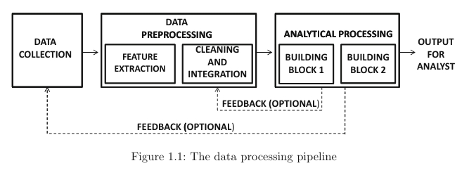
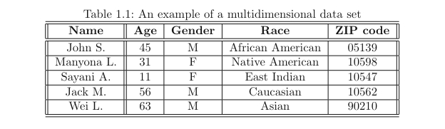
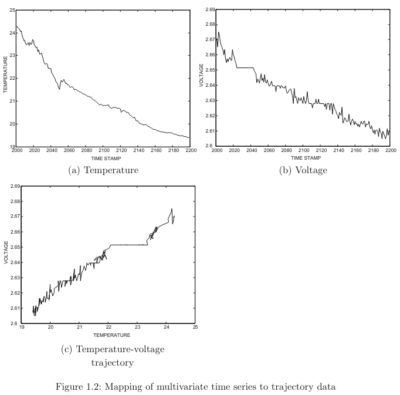
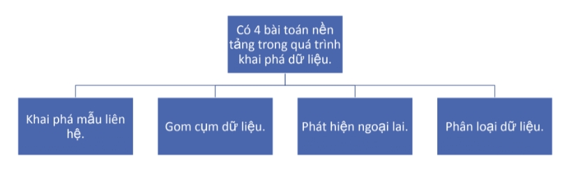

#HCMUS #DataMining

# Thông tin kỳ thi

Thời gian: 9h55 - 29/06/2024

Phòng thi: E403 (NVC)

# Overview

Đây là note của toàn bộ môn học. Chuẩn bị cho kỳ thi cuối kỳ sắp tới.

Note sẽ bám theo sách **Data Mining The Textbook** gồm các nội dung sau:

1. An Introduce to Data Mining
2. Data Preparation
3. Similarity & Distances
4. Association Pattern Mining
5. Cluster Analysis
6. Outlier Analysis
7. Data Classification

# 1. Introduce to Data Mining

#DataMining/AssociationPatternMining
#DataMining/DataClustering
#DataMining/OutlierDetection
#DataMining/DataClassification
#DataMining/DataCollection
#DataMining/DataPreprocessing
#DataMining/DataPreprocessing/FeatureExtraction
#DataMining/StreamingData

## 1.1. Introduce

Data mining là quá trình collect, clean, process, analyzing và gain useful insights từ data của nhiều domain khác nhau.

Do đó, 'data mining' là cách gọi tổng quát để miêu tả các khía cạnh khác của data processing.

Các nhà phân tích dữ liệu sẽ sử dụng hệ thống xử lý, trong đó, các dữ liệu thô sẽ được:

- Thu thập
- Làm sạch
- Chuyển đổi thành một định dạng tiêu chuẩn hóa

Dữ liệu có thể có nhiều định dạng hoặc kiểu khác nhau.

- Định lượng (quantitative)
- Định tính (categorical || quanlitative)
- Văn bản (text)
- Không gian (spatial), thời gian (temporal)
- Biểu đồ (graph-oriented)

Hầu hết dữ liệu trong thực tế là multidimensional data. Các loại dữ liệu có cấu trúc phức tạp dần dần có tỷ lệ ngày càng tăng

## 1.2. The Data Mining Process

Data Mining Process là một pipeline chứa nhiều phases khác nhau như:

1. **Data Collection**: là quá trình yêu cầu sử dụng nhiều phương pháp khác nhau để collect dữ liệu. Đây là một quá trình rất quan trọng ảnh hưởng trực tiếp đến DMP (stand for Data Mining Process). Sau quá trình collection, data sẽ được lưu trữ ở database hoặc data warehouse (dành cho processing)
2. **Feature extraction và data cleaning**: Sau khi dữ liệu đã được collect, chúng thường không phù hợp để processing ngay. Trong nhiều trường hợp, data có nhiều type khác nhau sẽ mix lại với nhau, transform chúng, biến data thành dạng suitable type, chẳng hạn như multidimensional, time series, semistructured format. Thường quá trình feature extraction sẽ song song với data cleaning. Đầu ra cuối cùng sẽ là structured data set, có thể được sử dụng bởi computer program. Sau đấy, dữ liệu sẽ lại một lần nữa được lưu trữ ở database.
3. **Analytical processing and algorithms**: Đây là final part của DMP. Part này giúp đưa ra các useful insights hoặc các dự đoán có lợi

### 1.2.1. The Data Preprocessing Phase

Đây là giai đoạn quan trọng nhất trong quá trình xử lý dữ liệu

Bao gồm các bước:

1. Feature Extraction
2. Data Cleaning
3. Feature selection and transformation

### 1.2.2. The Analytical Phase

## 1.3. The Basic Data Types

Có hai loại chính:

### 1.3.1. Dữ liệu định hướng không phụ thuộc

Là dạng dữ liệu đơn giản nhất và thường được gọi là dữ liệu nhiều chiều

Có hai loại phụ thuộc:

1. Phụ thuộc ngầm: các phụ thuộc giữa các mục dữ liệu không được chỉ định rõ ràng nhưng chúng "thường" tồn tại trong lĩnh vực đó. Ví dụ: nhiệt độ đo được từ cảm biến ở các thời điểm khác nhau, nếu ở hai thời điểm gần nhau mà nhiệt độ chêch lệch lớn thì đấy là dấu hiệu của sự không bình thường.
2. Phụ thuộc tường minh: Thường ám chỉ đến dữ liệu đồ thị (graph) hoặc mạng (network data) trong đó các cạnh được sử dụng để chỉ định mối quan hệ rõ ràng.

Dữ liệu định hướng phụ thuộc có thể được phân thành các loại sau:

- Time-Series data: Dữ liệu chuỗi thời gian chứa các giá trị thường được tạo ra bởi việc đo liên tục trong thời gian
- Discrete Sequences and Strings: Dãy rời rạc có thể được coi là biến thể của dữ liệu chuỗi thời gian. Giống như dữ liệu chuỗi thời gian, contextual attribute (thuộc tính ngữ cảnh) là một time stamp hoặc position index. Behavioral attribute (thuộc tính hành vi) là một catogorical value. Do đó, dữ liệu dãy rời rạc được định nghĩa tương tự dữ liệu chuỗi thời gian.
- Spatial Data: bao gồm nhiều attribute không tuân theo không gian (nonspatial attributes) (ví dụ: nhiệt độ, áp suất...) được đo dựa trên không gian của chúng. Ví dụ: nhiệt độ bề mặt biển.
- Network and Graph Data:

### 1.3.2. Dữ liệu định hướng phụ thuộc

Được phân thành các loại như:

- Quantitative Multidimensional Data (dữ liệu nhiều chiều định lượng được)
- Categorical and Mixed Attribute Data (dữ liệu phân loại và dữ liệu thuộc tính trộn lẫn)
- Binary and Set Data (dữ liệu nhị phân và dữ liệu tập hợp)
- Text Data (dữ liệu văn bản)

Thông tin về sự phụ thuộc có từ trước có ảnh hướng rất lớn đến DMP

## 1.4. The Major Building Blocks: A Bird’s Eye View

Association Pattern Mining
Data Clustering
Outlier Detection
Data Classification

Các mục này sẽ được đề cập rõ hơn sau

### 1.4.5. Impact of Complex Data Types on Problem Definitions

Các loại dữ liệu cụ thể sẽ gây ảnh hưởng lớn đến các bài toàn đặt ra, đặc biệt là các loại dữ liệu phức tạp

Ví du:

1. Nếu dữ liệu đầu vào của bài toán Association Pattern Mining là time-series thì thay vì chăm chăm nghiên cứu sự giống hay khác nhau thì ta nên xem xét tính tuần hoàn của dữ liệu dựa trên mốc thời gian.
2. Hoặc với bài toàn Data Clustering mà dữ liệu là time-series thì không thể sử dụng khoảng cách Euclidean để tính khoảng cách được, cần phải tìm một công thức khác

## 1.5. Scalability Issues and the Streaming Scenario

Với lượng dữ liệu ngày càng lớn thì chúng ta có 2 tình huống mở rộng như sau.

- Dữ liệu được chứa trên một hoặc nhiều máy, nhưng quá nhiều để xử lý một cách hiệu quả.
- Dữ liệu được sinh ra liên tục theo thời gian và với lượng lớn, việc lưu trữ toàn bộ không thực tế. Đây là tình huống dòng dữ liệu (streaming data).

Hai thử thách với dòng dữ liệu lớn:

1. One-pass constraint: Một số thuật toán cần phải duyệt qua toàn bộ lượng dữ liệu trong một lần. Tuy nhiên, lượng dữ liệu này phải tùy thuộc vào dung lượng lưu trữ có sẵn tại thời điểm đó.
2. Concept drift: data distribution có thể thay đổi liên tục theo thời gian. Phân phối của dữ liệu bán hàng của một công ty ở một tiếng trước chắc chắn sẽ khác so với một tiếng sau đó. Điều này dẫn đến việc kết quả đầu ra sẽ thay đổi.

## 1.6. Some Application Scenarios

1. **Store Product Placement**
   Dựa vào bộ sản phẩn trước đó của người mua. Người bán muốn biết cách đặt sản phẩm lên kệ như thế nào để tăng khả năng các món hàng được mua cùng nhau sẽ đặt các kệ liền kề nhau
2. **Product Recommendation**
   Dựa vào một số ít mặt hàng đã được chọn của khách hàng, sử dụng thuật toán để đưa ra recommend các mặt hàng tiếp theo
3. **Web Log Anomalies**
   Dựa vào một set các web logs có sẵn. Xác định xem đâu là các đoạn log bất thường
4. **Medical ECG Diagnosis**
   Xem xét một chuỗi thời gian ECG được thu thập từ các bệnh nhân khác nhau. Xác định chuỗi bất thường trong đó

# 2. Data Preparation

#DataMining/DataPreprocessing
#DataMining/DataPreprocessing/FeatureExtraction
#DataMining/DataPreprocessing/DataCleaning
#DataMining/DataPreprocessing/Normalization
#DataMining/DataPreprocessing/Reduction

## 2.1. Introduction

- Định dạng của dữ liệu thực tế rất đa dạng.
- Trong dữ liệu có thể có nhiều giá trị bị thiếu, không đồng nhất hoặc có lỗi sai.
  --> Có nhiều thử thách khi muốn sử dụng dữ liệu hiệu quả.

Các bước chuẩn bị dữ liệu bao gồm:

1. Feature Extraction and portability (trích xuất đặc trưng và khả năng biến đổi kiểu dũ liệu)
2. Data Cleaning
3. Data Reduction, selection, and transformation

## 2.2. Feature extraction and portability

### 2.2.1. Feature Extraction

Trong một số trường hợp, trích xuất đặc trưng có quan hệ mật thiết với khái niệm về khả năng biến đổi kiểu dữ liệu. Với khả năng biến đổi kiểu dữ liệu, các đặc trưng bậc thấp của một kiểu dữ liệu có thể được biến đổi thành các đặc trưng bậc cao hơn của một kiểu dữ liệu khác

1. **Sensor data**: thường được collect dưới dạng khối lượng lớn các tín hiệu low-level. Các tính hiệu low-level này sẽ được chuyển đổi thành higher-level features bằng các thuật toán như wavelet hoặc Fourier transforms
2. **Image data**: Ở raw data, hình ảnh được lưu trữ ở dạng các pixel. Do ảnh là dữ liệu thường có nhiều chiều nên việc trích xuất đặc trưng tùy thuộc vào mức độ khác nhau của dự án
3. **Web logs**: thường biểu diễn ở dạng text string nên khá dễ để convert sang các thuộc tính categorical hay numeric
4. **Network traffic**: trong nhiều ứng dụng phát hiện xâm nhập, các đặc điểm liên quan đến network packets thường được sử dụng để phân tích hành vi, chẳng hạn như số byte transfer, network protocol (giao thức mạng) sử dụng, ...
5. **Document data**: dữ liệu ở dạng raw thường ko có cấu trúc. Chúng chứa nhiều mối quan hệ giữa các thực thể khác nhau. Một số cách tiếp cận là remove stop words, sử dụng bag-of-words, ...

Tùy thuộc vào mức độ và kiểu dữ liệu của ứng dụng mà chọn cách tiếp cận feature extraction khác nhau

### 2.2.2 Data Type Portability

- Khả năng biến đổi kiểu dữ liệu có vai trò rất quan trọng do dữ liệu thường không thuần nhất mà chứa nhiều kiểu khác nhau.
- Với các dữ liệu không thuần nhất như vậy, chúng ta sẽ có các vấn đề sau.
  - Cần thiết kế thuật toán cho một tổ hợp kiểu dữ liệu bất kì.
  - Khó sử dụng các công cụ xử lý có sẵn.
- Trong một số trường hợp, việc biến đổi kiểu dữ liệu dẫn đến việc mất độ chính xác và tính biểu đạt.

Bảng các thuật toán để biến đổi dữ liệu

![[Pasted image 20240625124144.png]]

#### 1. Discretization: rời rạc hóa

#### 2. Binarization: nhị phân hóa

#### 3. LSA: _đề cập sau_

#### 4. SAX, DWT (Discrete Wavelet Transform), DFT (Discrete Fourier Transform): [link chatgpt](https://chatgpt.com/share/4cc2a243-6f4a-46ac-9336-146373efdf01)

## 2.3. Data Cleaning

- Xử lý dữ liệu bị thiếu
  - Loại bỏ
  - Sử dụng phương pháp uớc lượng hoặc điền khuyết
  - Dùng các thuật toán được thiết kế để hoạt động với dữ liệu bị thiếu
- Xử lý dữ liệu sai
  - Phát hiện sự không đồng nhất
  - Sử dụng kiến thức chuyên môn
  - Các phương pháp tập trung dữ liệu. Ví dụ: dùng các đặc tính thống kê của dữ liệu để lọc ngoại lai
- Scale và chuẩn hóa dữ liệu
  - Standardization
  - Min-max scaling
  - ...

## 2.4. Data Reduction and Transformation

### 2.4.1. Data Sampling

Lợi thế của lấy mẫu dữ liệu là sự đơn giản, trực quan và dễ thực hiện

Có 2 cách thức lấy mẫu dữ liệu

1. **Lấy mẫu cho dữ liệu tĩnh (static data)**

   Với lấy mẫu cho dữ liệu tĩnh. Khi toàn bộ dữ liệu đã có sẵn và từ đó số điểm dữ liệu gốc được biết thì việc lấy mẫu đơn giản hơn.

   Với cách lấy mẫu không chệch (unbiased sampling)
   một tỉ lệ dữ liệu được định trước và giữ nguyên trong suốt quá trình phân tích. Có hai cách như sau:

   - **Lấy mẫu không hoàn lại (without replacement):** Các bản ghi `n * f` được chọn ngẫu nhiên từ tập dữ liệu _D_ chứa các bản ghi _n_, trong đó _f_ biểu thị tỷ lệ các điểm dữ liệu sẽ được đưa vào mẫu. Phương pháp này ngăn không cho cùng một bản ghi được đưa vào nhiều lần trừ khi tập dữ liệu gốc chứa các bản sao.
   - **Lấy mẫu có hoàn lại (with replacement):** Các bản ghi được lấy mẫu tuần tự và độc lập với tập dữ liệu _D_ chứa các bản ghi _n_ với tổng số `n * f` lần. Phương pháp này cho phép đưa cùng một bản ghi vào mẫu nhiều lần.

   Ngoài kiểu unbiased sampling, chúng ta còn một số loại lấy mẫu khác:

   - **Lấy mẫu chệch (Biased Sampling)**: Do một số phần dữ liệu quan trọng hơn, được đánh giá cao hơn trong phần lấy mẫu dựa vào tầm quan trọng của chúng trong quá trình phân tích
   - **Lấy mẫu phân tầng (Stratified Sampling)**: Dữ liệu trước tiên sẽ chia thành các nhóm, sau đó lấy mẫu một số điểm dữ liệu xác định trước từ mỗi tầng.

2. **Lấy mẫu reservoir cho dòng dữ liệu**

   Các dòng dữ liệu thường ko kích thước cố đinh mà liên tục có các điểm dữ liệu mới. Với cách lấy mẫu này, một mẫu với _k_ điểm cho trước được duy trì một cách linh động từ dòng dữ liệu.

   Do kích thước rất lớn của một dòng dữ liệu, chúng ta cần các bước xử lý để duy trì tập mẫu _k_ điểm với mỗi điểm dữ liệu mới từ dòng.

   Với mỗi điểm dữ liệu mới, chúng ta có 2 quyết định sau:

   - Luật lấy mẫu nào để quyết định xem điểm dữ liệu mới có được cho vào mẫu hay không
   - Luật nào để quyết định xem một điểm dữ liệu cũ trong mẫu có bị bỏ ra để có chỗ cho điểm dữ liệu mới

   Với một reservoir kích thước _k_ điểm dữ liệu, chúng ta sẽ lấy _k_ điểm đầu tiên trong dòng dữ liệu để khởi tạo reservoir.

   Sau đó, với điểm dữ liệu thứ _n_ từ dòng, chúng ta có 2 quyết định điều khiển sau:

   - Cho điểm thử n vào reservoir với xác xuất _k/n_.
   - Nếu điểm dữ liệu mới được cho vào thì loại bỏ một trong _k_ điểm dữ liệu cũ một cách ngẫu nhiên.

### 2.4.2. Feature Selection

Một cách khác để rút gọn dữ liệu là loại bỏ đi các đặc trưng không quan trọng.
Chỉ lựa chọn các subset of features từ dữ liệu để sử dụng. Cách chọn subset tùy theo riêng từng application

Có 2 phương pháp chính trong việc feature selection:

1. Unsupervised feature selection: _đề cập ở chương Data Clustering_
2. Supervised //: _đề cập ở chương Data Classification_

### 2.4.3. Data reduction with axis rotation (Giảm chiều bằng phép xoay trục)

Trong dataset thực tế thường tồn tại các tương quan giữa các feature khác nhau và chúng thường không chặt chẽ và xác định một cách thủ công.

Từ các ràng buộc và tương quan trên, một số thông tin từ một chiều có thể dùng để dự đoán thong tin của các chiều khác.

1. **PCA (Principal Component Analysis)**: Mục tiêu của PCA là xoay dữ liệu về một hệ trục sao cho lượng phương sai lớn nhất có thể được biểu diễn bởi một số chiều nhỏ nhất. Phương sai của một tập dữ liệu theo một hướng cụ thể có thể được thể hiện thông qua ma trận phương sai của dữ liệu. Có thể chứng minh được ma trận phương sai là đối xứng, nửa xác định dương. Từ đó, ma trận này chéo hóa được và các trị riêng của ma trận phương sai biểu diễn phương sai của dữ liệu dọc theo vectors riêng tương ứng. Do đó các vectors riêng với trị riêng lớn sẽ thể hiện phương sai lớn hơn và được gọi là các principal component, các trục chính mới chúng ta dùng để biểu diễn dữ liệu.
2. **SVD (Singular value decomposition)**: SVD có quan hệ gần với PCA. SVD có 2 bộ vector cơ sở thay vì 1 như PCA. SVD cho cùng vector cơ sở với PCA nêu các thuộc tính của dữ liệu có trung bình là 0
3. **LSA (Latent Semantic Analysis)**: là một ứng dụng của SVD với dữ liệu văn bản. Với dữ liệu văn bản, mỗi dòng của ma trận dữ liệu ứng với mỗi văn bản trong dữ liệu và chứa tần suất xuất hiện của mỗi từ của văn bản đó. Do đây là ma trận thưa nên trung bình của mỗi cột rất gần 0, điều này dẫn đến kết quả khá gần với PCA, mặc dù không sử dụng mean centering. Tính thưa của ma trận cũng dẫn đến số chiều nội tại thấp, điều này cũng dẫn đến việc giảm số chiều bằng LSA có thể rất mạnh.

Ngoài giảm chiều dữ liệu và nén dữ liệu thì PCA và SVD còn các ứng dụng khác như: Khử nhiễu, điền khuyết, giải hệ tuyến tính, nghịch đảo ma trận, ...

Ví dụ và cách tính chi tiết của PCA, SVD, LSA, tham khảo [link gpt](https://chatgpt.com/share/e96603d4-7b3d-46a9-ab28-aa20339ae961)

### 2.4.3. Data reduction with type transformation

Với các phương pháp này thì việc rút giảm dữ liệu đi kèm với biến đổi kiểu dữ liệu. Thông thường thì dữ liệu sẽ được biến đổi từ một kiểu phức tạp về một kiểu ít phức tạp hơn.

Ta sẽ tìm hiểu hai phương pháp là

1. Time-series to multidimensional using Haar Wavelet Transform: Chúng ta có thể dùng kĩ thuật wavelet để khai triển một time series thành các vector cơ sở wavelet có trọng số. Mỗi trọng số này thể hiện độ biến thiên của time series giữa 2 nửa của một khoảng thời gian. Trong ứng dụng giảm số chiều, các hệ số lớn (sau khi chuẩn hóa) sẽ được giữ lại.
2. Weighted Graphs to multidimensional using multidimensional scaling and Spectral methods
   Xem thêm tại [link chatgpt](https://chatgpt.com/share/1f3cef73-5461-4b47-941f-0c28e155b13a)

# 3. Similarity and Distances

#DataMining/Similarity
#DataMining/Distances

## 3.1. Introduction

Trong nhiều ứng dụng khai phá dữ liệu, chúng ta cần xác định các đối tượng dữ liệu tương đồng, hoặc không tương đồng.

Việc lựa chọn hàm tương đồng (hoặc hàm khoảng cách, tùy thuộc ứng dụng) rất quan trọng trong thiết kế của các thuật toán.

## 3.2. Quantitative Data

Công thức khoảng cách phổ biến nhất với dữ liệu định lượng là $L_p - Norm$

$$
Dist(\overline{X}, \overline{Y}) = \bigg( \sum_{i=1}^d |x_i - y_i|^p \bigg) ^{1/p}$$2 giá trị *p* hay dùng nhất là *p = 1* (Euclidean) và *p = 2* (Manhattan)

### 3.2.1. Impact of Domain-Specific Relevance

Do ảnh hướng về tầm quan trọng của feature này so với feature kia. Công thức $L_p - Norm$ sẽ được thêm trọng số phía trước và trở thành công thức *Minkowski*

$$Dist(\overline{X}, \overline{Y}) = \bigg( \sum_{i=1}^d a_i . |x_i - y_i|^p \bigg) ^{1/p}
$$

### 3.2.2. Impact of High Dimensionality

Rất nhiều ứng dụng khai phá dữ liệu bị mất tính hiệu quả khi số chiều của dữ liệu tăng cao. Hiện tượng này được gọi là “curse of dimensionality”.

### 3.2.3. Impact of Locally Irrelevant Features

...

### 3.2.4. Impact of Different $L_p - Norm$

Với các _p_ lớn thì ảnh hưởng của các thuộc tính không quan trọng thường được nhấn mạnh.

### 3.2.5. Match-Based Similarity Computation

...

### 3.2.6. Impact of Data Distribution

Trong nhiều ứng dụng, việc tính khoảng cách còn phụ thuộc vào phân phối của dữ liệu.

![[Pasted image 20240625171700.png]]

Như trong hình thì đường nối tâm O đến điểm A nằm theo hướng có phương sai cao, còn đường nối tâm O đến điểm B thì có dữ liệu thưa và nằm theo hướng có phương sai thấp. Theo cách nhìn này, có thể đánh giá đoạn OB dài hơn OA. Khoảng cách Mahalanobis cũng được dựa trên nguyên lý này.

$$
Maha(\overline{X}, \overline{Y}) = \sqrt{(\overline{X}- \overline{Y}) \Sigma^{-1} (\overline{X}- \overline{Y})^T}
$$

### 3.2.7 Nonlinear Distributions: ISOMAP

![[Pasted image 20240625171937.png]]

Ảnh hưởng của ISOMAP đã giúp ta thấy được khoảng cách của điểm A và C là xa nhất, so với dùng khoảng cách truyền thống thì A, C là khoảng cách gần nhất

Cách tính gồm 2 bước:

1. Tính _k_-nearest neighbors của từng điểm. Xây dựng đồ thị trọng số _G_ với từng node biểu thị cho các điểm dữ liệu và cạnh biểu thị khoảng cách của _k_-nearest neighbors này.
2. Đối với bất kỳ cặp điểm X, Y nào, Dist(X,Y) là đường đi ngắn nhất giữa các nút tương ứng trong đồ thị _G_

### 3.2.8. Impact of Local Data Distribution

![[Pasted image 20240625172519.png]]

Phân phối dữ liệu có thể thay đổi đáng kể theo từng cục bộ, dẫn tới việc tính toán có thể thay đổi

Như hình vẽ 3.6a, khoảng cách giữa (A,B) và (C,D) được cho là bằng nhau (theo Euclidean) nhưng do có sự khác biệt về mật độ phân phối nên (C,D) nên được cho là lớn hơn (A,B). Điều này chứng tỏ là (C,D) nên được cho là ở xa hơn trong bối cảnh địa phương của chúng. Vấn đề này thường gặp trong các phương pháp dựa trên khoảng cách như phát hiện điểm ngoại lai và một trong những pp nổi tiếng đó là LOF (Local Outlier Factor)

Đối với hình 3.6b, khoảng cách giữa (A, B) và (C, D) là giống nhau khi sử dụng metric Euclidean. Tuy nhiên, các cụm địa phương trong mỗi vùng có định hướng rất khác nhau. Trục có phương sai cao của cụm dữ liệu liên quan đến (A, B) thẳng hàng với đường từ A đến B, nhưng điều này không đúng với (C, D). Do đó, khoảng cách nội tại giữa C và D lớn hơn so với A và B. Ví dụ, nếu khoảng cách Mahalanobis địa phương được tính toán sử dụng thống kê hiệp phương sai cụm liên quan, thì khoảng cách giữa C và D sẽ lớn hơn khoảng cách giữa A và B.

## 3.3. Categorical Data

Một cách đơn giản để tính khoảng cách giữa các dữ liệu định tính là sử dụng kĩ thuật nhị phân hóa (one hot encoding)

Với dữ liệu định tính thì chúng ta thường làm việc với sự tương đồng hơn khoảng cách.

Với bản ghi X và Y. Sự tương đồng đơn giản nhất giữa 2 bản ghi này là

$$
Sim(X,Y) = \sum_{i=1}^d S(x_i, y_i)
$$

trong đó, $S(x_i, y_i)$ là hàm similarity

Hàm similarity đơn giản nhất là set $S(x_i, y_i)$ bằng 1 nếu $x_i = y_i$ hoặc bằng 0 nếu ngược lại

Với trường hợp là categorical data, aggregate statistical properties (tính chất thống kê gộp chung) của tập dữ liệu nên được sử dụng khi tính similarity

Ý tưởng quan trọng ở đây là các cặp giống nhau với một giá trị hiếm nên có trọng số cao hơn so với các giá trị phổ biến. Từ đó, chúng ta có khái niệm _"Tần suất xuất hiện ngược"_ (inverse occurence frequency)

$$
S(x_i, y_i) = \begin{cases} 1/p_k(x_i)^2 & \text{if } x_i = y_i \\ 0 & \text{otherwise} \end{cases}
$$

Với $p_k(x)$ là tỉ lệ records tại attribute thứ _k_ có giá trị _x_ trong tập dữ liệu. Nói cách khác, $p_k(x)$ là tần suất xuất hiện của giá trị _x_ cho thuộc tính thứ _k_

Một công thức khác cũng có tư tưởng giống với công thức trên là công thức _Goodall_

$$
S(x_i, y_i) = \begin{cases} 1 - p_k(x_i)^2 & \text{if } x_i = y_i \\ 0 & \text{otherwise} \end{cases}
$$

# 3.4. Mixed Quantitative and Categorical Data

Với các dữ liệu trộn định tính và định lượng thì ta dùng các trọng số lần lượt cho các thành phần

Cụ thể với $X = (X_n, X_c), Y = (Y_n, Y_c)$
Chúng ta có thể tính độ tương đồng giữa hai bản ghi này với công thức

$$
Sim(X,Y) = \lambda \cdot NumSim(X_n, Y_n) + (1 - \lambda) \cdot CatSim(X_c, Y_c)
$$

Bên cạnh đó, để có thể so sánh các giá trị tương đồng của các thuộc tính định lượng và các thuộc tính định tính thì chúng ta cần chuẩn hóa. Một cách để chuẩn hóa là sử dụng độ lệch chuẩn của các giá trị tường đồng trên 2 miền thành phần.

$$
Sim(X,Y) = \lambda \cdot NumSim(X_n, Y_n) / \sigma_n + (1 - \lambda) \cdot CatSim(X_c, Y_c) / \sigma_c
$$

## 3.5. Text Document Data

Văn bản có thể được xem là dữ liệu định lương đa chiều với tần suất xuất hiện của mỗi từ là một thuộc tính.

Trường hợp này thì các khoảng cách sử dụng chuẩn Lp không thích hợp với các văn bản có độ dài khác nhau.

Một cách để tránh trở ngại với độ dài văn bản là dùng độ đo cosine để tính góc giữa các văn bản.

Với 2 bản ghi $X = (x_1, \dots, x_d), Y = (y_1, \dots, y_d)$, ta có

$$
cosine(X, Y) = \frac{\sum x_i \cdot y_i}{\sqrt{\sum x_i^2} \cdot \sqrt{\sum y_i^2}}
$$

Xét đến tấn suất xuất hiện ngược của document data, nếu hai đoạn document match với nhau những uncommon word, thì IDF (_inverse document frequency_) $id_i$ sẽ lớn

$$
idf_i = \log(n/n_i)
$$

Đây là một hàm nghịch biến với $n_i$ là số lượng document chứa từ thứ _i_

Normalized Frequency (tần suất chuẩn hóa) $h(x_i)$ cho word thứ _i_ bằng $h(x_i) = f(x_i) \cdot idf_i$ với $f(x_i)$ là damping function (hàm giảm tần suất), thường bằng $\sqrt{x_i}$, $\log(x_i)$, hoặc $x_i$

Từ đó suy ra công thức cosine sau khi sử dụng normalized frequency là

$$
cosine(X, Y) = \frac{\sum h(x_i) \cdot h(y_i)}{\sqrt{\sum h(x_i)^2} \cdot \sqrt{\sum h(y_i)^2}}
$$

Phương pháp này đảm bảo rằng các từ ít gặp và có ý nghĩa hơn sẽ có trọng số cao hơn trong việc tính toán độ tương đồng giữa các tài liệu, cải thiện độ chính xác của phép đo cosine ban đầu.

Một công thức có mục tiêu tương tụ nhưng ít phổ biến hơn là _Jaccard coefficient_ , thường được sử dụng cho sparse binary data sets

![[Pasted image 20240625222122.png]]

## 3.6. Binary and Set Data

Dữ liệu nhị phân là một dạng đặc biệt của dữ liệu dạng tập hợp, trong đó giá trị 1 biểu thị sự có mặt của một phần tử trong tập hợp, còn giá trị 0 biểu thị sự vắng mặt của phần tử đó

Dữ liệu nhị phân thường gặp trong các lĩnh vực như giỏ hàng (marketbasket), nơi mà các giao dịch chứa thông tin về việc một mặt hàng có xuất hiện trong giao dịch hay không

Dữ liệu này có thể được coi là một trường hợp đặc biệt của dữ liệu văn bản

$$
J(X, Y) = \frac{\sum_{i=1}^{d} x_i \cdot y_i}{\sum_{i=1}^{d} x_i^2 + \sum_{i=1}^{d} y_i^2 - \sum_{i=1}^{d} x_i \cdot y_i}
$$

Điều này tương đương với công thức:

$$
J(X, Y) = \frac{|S_X \cap S_Y|}{|S_X \cup S_Y|}
$$

Công thức này chính là chỉ số Jaccard (Jaccard Index), một phép đo phổ biến cho độ tương đồng giữa hai tập hợp.

## 3.7. Time-Series Similarity Measures

Cách biểu diễn theo dãy rời rạc có thể xem là dạng rời rạc của cách biểu diễn theo chuỗi thời gian liên tục.

Việc thiết kế độ đo tương đồng cho time-series phụ thuộc vào từng ứng dụng. Một số yếu tố ảnh hưởng như sau:

1. Scaling và Translation của Thuộc tính Hành Vi (Behavioral attribute scaling and translation)
2. Translation Thuộc Tính Ngữ Cảnh Theo Thời Gian (Temporal (contextual) attribute translation)
3. Scaling Thuộc Tính Ngữ Cảnh Theo Thời Gian (Temporal (contextual) attribute scaling)
4. Không Liên Tục Trong Việc So tương đồng (Noncontiguity in matching)

### 3.7.1. Impact of Behavioral Attribute Normalization

1. **Dịch Chuyển Thuộc Tính Hành Vi (Behavioral Attribute Translation)**: Thuộc tính hành vi được chuẩn hóa trung bình trong quá trình tiền xử lý. Điều này có nghĩa là giá trị trung bình của thuộc tính sẽ được dịch chuyển về 0.
2. **Biến Đổi Tỷ Lệ Thuộc Tính Hành Vi (Behavioral Attribute Scaling)**: Độ lệch chuẩn của thuộc tính hành vi được chuẩn hóa về 1 đơn vị. Điều này có nghĩa là các giá trị thuộc tính sẽ được chia cho độ lệch chuẩn của chúng để có được một thang đo thống nhất.

Lưu ý rằng không phải lúc nào các vấn đề chuẩn hóa này cũng liên quan đến mọi ứng dụng. Một số ứng dụng có thể chỉ cần dịch chuyển, chỉ cần biến đổi tỷ lệ, hoặc không cần cả hai. Các ứng dụng khác có thể cần cả hai bước chuẩn hóa. Thực tế, việc chọn sai phương pháp chuẩn hóa có thể gây hại cho khả năng diễn giải kết quả. Do đó, người phân tích cần cẩn thận lựa chọn phương pháp chuẩn hóa phù hợp dựa trên nhu cầu cụ thể của ứng dụng.

### 3.7.2. $L_p - Norm$

Phép đo này coi một chuỗi thời gian như một điểm dữ liệu đa chiều, trong đó mỗi dấu thời gian là một chiều.

Các điểm chính trong đoạn văn bao gồm:

1. **Áp dụng chuẩn $L_p$ cho chuỗi thời gian**:

   - Chuẩn $L_p$ có thể áp dụng cho các chuỗi thời gian bằng cách coi mỗi dấu thời gian là một chiều dữ liệu.

2. **Áp dụng chuẩn $L_p$ cho biến đổi wavelet của chuỗi thời gian**:

   - Chuẩn $L_p$ cũng có thể áp dụng cho các biến đổi wavelet của chuỗi thời gian.
   - Khi $p = 2$ và nếu giữ lại hầu hết các hệ số wavelet lớn, việc tính toán khoảng cách sẽ chính xác với đại diện wavelet.
   - Nếu không loại bỏ bất kỳ hệ số wavelet nào, thì khoảng cách giữa hai đại diện sẽ giống nhau. Điều này là do biến đổi wavelet có thể được coi là một sự xoay trục hệ tọa độ, trong đó mỗi chiều đại diện cho một dấu thời gian. Các phép đo Euclidean không thay đổi theo sự xoay trục.

3. **Hạn chế của chuẩn $L_p$**:

   - Chuẩn $L_p$ được thiết kế cho các chuỗi thời gian có chiều dài bằng nhau.
   - Nó không thể giải quyết các biến dạng về thuộc tính ngữ cảnh (temporal contextual attributes), chẳng hạn như sự co giãn hoặc dịch chuyển trong trục thời gian.

Chuẩn $L_p$ là một công cụ hữu ích để đo khoảng cách giữa các chuỗi thời gian có chiều dài bằng nhau, đặc biệt khi áp dụng với biến đổi wavelet. Tuy nhiên, nó gặp khó khăn khi phải xử lý các biến dạng ngữ cảnh theo thời gian.

### 3.7.3. Dynamic Time Warping Distance

![[Pasted image 20240625225720.png]]

1. **Định Nghĩa và Ứng Dụng của DTW**:

   - DTW kéo dài chuỗi dọc theo trục thời gian một cách động (dynamic) để tạo ra sự khớp tốt hơn giữa các chuỗi. Phương pháp này xuất phát từ lĩnh vực nhận dạng giọng nói để điều chỉnh các tốc độ nói khác nhau.
   - DTW có thể được sử dụng cho cả dữ liệu chuỗi thời gian và chuỗi tuần tự, vì nó chỉ giải quyết vấn đề biến đổi thuộc tính ngữ cảnh (contextual attribute scaling) và không liên quan đến bản chất của thuộc tính hành vi (behavioral attribute).

2. **Ưu Điểm của DTW so với Lp-norm**:

   - Trong khi Lp-norm chỉ có thể áp dụng cho các chuỗi có độ dài bằng nhau, DTW cho phép đo khoảng cách giữa hai chuỗi có độ dài khác nhau.
   - Lp-norm sử dụng ánh xạ một-một giữa các dấu thời gian của hai chuỗi, còn DTW cho phép ánh xạ nhiều-một để giải quyết việc biến đổi thời gian.

3. **Quy Trình Tính Toán DTW**:

   - DTW cho phép lặp lại một số phần tử trong các đoạn được chọn một cách cẩn thận của một trong hai chuỗi để tạo ra hai chuỗi có độ dài bằng nhau, tạo ra ánh xạ một-một giữa chúng.
   - Khoảng cách có thể được đo trên các chuỗi đã được biến đổi sử dụng bất kỳ phương pháp đo khoảng cách nào như Lp-norm.

4. **Công Thức Tính Toán DTW**:

   - $DTW(i, j)$ được xác định tối ưu bằng cách sử dụng lập trình động:

   $$
   DTW(i, j) = \text{distance}(x_i, y_j) + \min \begin{cases}
   DTW(i, j - 1) & \text{repeat } x_i \\
   DTW(i - 1, j) & \text{repeat } y_j \\
   DTW(i - 1, j - 1) & \text{repeat neither}
   \end{cases}
   $$

5. **Triển Khai Thuật Toán**:

   - Thuật toán được khởi tạo với $DTW(0, 0) = 0 , DTW(0, j) = \infty$ cho $j \in \{1 ... n\}$, và $DTW(i, 0) = \infty$ cho $i \in \{1 ... m\}$.
   - Sau đó, tính toán giá trị $DTW(i, j)$ bằng cách thực hiện lặp đi lặp lại công thức trên với các giá trị chỉ số $i$ và $j$ tăng dần từ 1 đến $m$ và từ 1 đến $n$.

6. **Tối Ưu Hóa và Ràng Buộc Thực Tiễn**:

   - Đường đi tối ưu có thể được hiểu như một đường đi tối ưu qua các giá trị khác nhau của $i$ và $j$ trong lưới $m \times n$.
   - Một ràng buộc thông thường là ràng buộc cửa sổ, yêu cầu rằng DTW(i, j) chỉ được tính khi $|i - j| \leq w$. Điều này giúp giảm bớt số lượng giá trị cần tính toán trong quá trình đệ quy lập trình động.

7. **Mở Rộng DTW cho Nhiều Thuộc Tính Hành Vi**:

   - Khoảng cách DTW có thể dễ dàng mở rộng cho nhiều thuộc tính hành vi nếu giả định rằng các thuộc tính hành vi khác nhau có cùng sự biến dạng thời gian. Trong trường hợp này, công thức đệ quy không thay đổi, chỉ khác ở chỗ khoảng cách $\text{distance}(x_i, y_j)$ được tính bằng phương pháp đo khoảng cách dựa trên vector.

DTW là một công cụ mạnh mẽ để đo khoảng cách giữa các chuỗi thời gian, đặc biệt là khi các chuỗi có độ dài khác nhau và cần xử lý các biến dạng ngữ cảnh.

### 3.7.4. Window-Based Methods

Ý tưởng ở đây là nếu hai chuỗi có nhiều đoạn liên tiếp giống nhau, chúng nên được coi là tương tự. Đối với các chuỗi thời gian dài, việc so khớp toàn cầu trở nên khó khăn. Do đó, lựa chọn hợp lý là sử dụng các cửa sổ để đo lường độ tương đồng theo từng đoạn.

$$Sim(X,Y) = \sum_{i=1}^r Match(Xi​,Yi​)$$

Các phương pháp dựa trên cửa sổ nhằm giải quyết vấn đề dữ liệu bị mất bằng cách phân chia chuỗi thời gian thành các cửa sổ không chồng lấp và đo lường độ tương đồng của từng cặp cửa sổ.

Độ tương đồng tổng thể giữa hai chuỗi được tính bằng tổng các giá trị độ tương đồng của từng cặp cửa sổ.

Việc xác định giá trị ${Match}(Xi,Yi)$ và phân chia chuỗi thành các cửa sổ tối ưu là những thách thức lớn trong phương pháp này.

## 3.8. Discrete Sequence Similarity Measures

Các độ đo tương đồng dãy rời rạc dựa trên cùng nguyên lý với các độ đo chuỗi thời gian.

Khi có ánh xạ song ánh giữa 2 dãy rời rạc tại các vị trí, nhiều độ đo khoảng cách định tính cho dữ liệu đa chiều có thể được áp dụng.

Tuy nhiên, trong các ứng dụng thực tế với dãy rời rạc thì các song ánh như vậy thường không tồn tại.

### 3.8.1. Edit Distance

Khoảng cách chỉnh sửa (còn gọi là khoảng cách Levenshtein) đo lường khoảng cách giữa hai chuỗi bằng cách tính chi phí tối thiểu để chuyển đổi một chuỗi thành chuỗi khác thông qua một loạt các phép biến đổi (chèn, xóa, thay thế).

Thay thế thường có chi phí cao hơn chèn hoặc xóa, trong khi chèn và xóa thường có chi phí bằng nhau.

$$
Edit(i, j) = min \begin{cases} Edit(i-1, j) + \text{Deletion Cost} \\
Edit(i, j-1) + \text{Insertion Cost} \\ Edit(i-1, j-1) + I_{ij} \cdot \text{Replacement Cost}
\end{cases}
$$

Ví dụ: Để chuyển đổi chuỗi "ababababab" thành "bababababa", có thể thực hiện 10 phép thay thế hoặc 1 phép xóa và 1 phép chèn.

Phương pháp này sử dụng lập trình động để tìm chi phí tối ưu và có thể mở rộng cho dữ liệu số với các phép biến đổi đặc thù cho chuỗi thời gian.

### 3.8.2. Longest Common Subsequence (LCSS)

Chuỗi con chung dài nhất

$$
LCSS(i, j) = \text{max} \begin{cases}
LCSS(i-1, j-1) + 1  & \text{only if } x_i = y_i \\
LCSS(i-1, j) & \text{otherwise (no match on } x_i)  \\
LCSS(i, j-1) & \text{otherwise (no match on } y_i) \end{cases}
$$

LCSS đo lường mức độ tương tự giữa hai chuỗi bằng cách tìm chuỗi con dài nhất mà cả hai chuỗi cùng chứa theo thứ tự tương tự. Phương pháp này sử dụng lập trình động để tìm giá trị tối ưu và có thể mở rộng cho chuỗi thời gian liên tục bằng cách phân loại giá trị chuỗi thời gian.

## 3.9. Graph Similarity Measures

Với các đồ thị thì sự tương đồng có thể được đo với nhiều cách
khác nhau, tùy thuộc được đo giữa 2 đồ thị hay 2 node trong 1 đồ
thị.

Các đồ thị ở đây được giả sử là vô hướng

### 3.9.1. Similarity between Two Nodes in a Single Graph

Trong một số lĩnh vực, như mạng thư tịch (bibliographic networks) thì các
cạnh được gắn trọng số (weights) và hàm tương đồng được dùng.

Trong một số lĩnh vực khác, như mạng giao thông thì các cạnh được gắn
chi phí (costs) và hàm khoảng cách được dùng.

Thông thường thì việc chuyển đổi giữa hàm tương đồng và khoảng cách
có thể thực hiện bằng các hàm kernel. Ví dụ: Kernel nhiệt $K(x) = e^{-x^2 / t^2}$

Tiêu chí Đo Lường Độ Tương Tự

- Đường Ngắn Nhất: Nút được kết nối qua các đường ngắn nên được coi là tương tự nhau hơn.
- Độ Kết Nối: Nút được kết nối qua nhiều đường nên được coi là tương tự hơn.

Tóm tắt: Độ tương tự giữa các nút trong một mạng không hướng có thể được đo lường dựa trên nguyên tắc đồng hình, với các tiêu chí như khoảng cách đường ngắn nhất và số lượng đường kết nối giữa các nút. Việc sử dụng các hàm kernel heuristic cho phép chuyển đổi giữa chi phí và trọng số, giúp phù hợp với các ứng dụng cụ thể.

#### 3.9.1.1. Biện Pháp Đo Khoảng Cách Cấu Trúc (Structural Distance-Based Measure)

Mục Tiêu: Đo khoảng cách từ một nút nguồn _s_ đến bất kỳ nút nào khác trong mạng.

Thuật toán sử dụng là thuật toán Dijkstra, đặc trưng là kiểm tra mỗi nút và cạnh liên kết đúng một lần

Đặc Điểm: Biện pháp này chỉ tập trung vào khoảng cách cấu trúc mà không tính đến số lượng đường đi giữa hai nút.

#### 3.9.1.2. Tương Tự Dựa trên Bước Ngẫu Nhiên (Random Walk-Based Similarity)

Hạn Chế của Đo Khoảng Cách Cấu Trúc: Không hiệu quả khi các cặp nút có số lượng đường đi giữa chúng khác nhau.

Nguyên Lý Bước Ngẫu Nhiên: - **Bước Ngẫu Nhiên Khởi Điểm từ _s_**: Bắt đầu từ nút nguồn _s_ và chuyển đến nút láng giềng với xác suất tỉ lệ với trọng số $w_{ij}$​. - **Xác Suất Khởi Động Lại**: Tại bất kỳ nút nào, có thể quay lại nút nguồn _s_ với một xác suất gọi là xác suất khởi động lại. - **Phân Phối Xác Suất**: Kết quả là một phân phối xác suất thiên về nút nguồn _s_, các nút giống _s_ sẽ có xác suất được ghé thăm cao hơn. - **Trực Giác**: Nếu bạn bị lạc trong một mạng đường và di chuyển ngẫu nhiên, bạn sẽ có khả năng cao đến được vị trí gần và có nhiều đường dẫn đến đó.

### 3.9.2. Similarity Between Two Graphs

Nhiều biện pháp, như khoảng cách chỉnh sửa đồ thị và sự tương tự dựa trên cấu trúc con, đã được đề xuất để giải quyết trường hợp khó khăn này. Ý tưởng cốt lõi trong mỗi phương pháp này là:

1. **Khoảng cách đồ thị con chung lớn nhất (Maximum common subgraph distance)**: Khi hai đồ thị chứa một đồ thị con lớn chung, chúng thường được coi là tương tự hơn
2. **Sự tương tự dựa trên cấu trúc con (Substructure-based similarity)**: Mặc dù rất khó để khớp hai đồ thị lớn, nhưng dễ dàng hơn nhiều để khớp các cấu trúc con nhỏ hơn. Ý tưởng cốt lõi là đếm các cấu trúc con thường xuyên xuất hiện giữa hai đồ thị và báo cáo nó như một biện pháp đo lường sự tương tự
3. **Khoảng cách chỉnh sửa đồ thị (Graph-edit distance)**: Tương tự edit distance chuỗi đã được định nghĩa
4. **Graph kernels**: Kernel đường đi ngắn nhất và Kernel bước ngẫu nhiên

Các phương pháp này khá phức tạp và yêu cầu nền tảng sâu rộng hơn về lĩnh vực đồ thị. Do đó, việc thảo luận về các biện pháp này được hoãn lại cho chương 17 của cuốn sách này.

## 3.10. Supervised Similarity Functions

Trong các phần trước đã thảo luận về các phương pháp đo sự tương tự không yêu cầu hiểu biết về ý đồ của người dùng. Tuy nhiên, trong thực tế, sự liên quan của một đặc trưng hay sự lựa chọn của hàm khoảng cách phụ thuộc rất nhiều vào lĩnh vực cụ thể

Ví dụ, trong tập dữ liệu hình ảnh, nên trọng số đặc trưng màu sắc hay đặc trưng kết cấu nhiều hơn?

Phản hồi từ người dùng có thể được biểu diễn dưới dạng các cặp đối tượng:

$$S = {(O_i, O_j): O_i \text{is similar to } O_j}$$
$$D = {(O_i, O_j): O_i \text{is dissimilar to } O_j}$$

# 4. Association Pattern Mining

## 4.1. Introduction

Bài toán khai phá mẫu liên hệ cổ điển được định nghĩa với dữ liệu siêu thị
chứa các tập hạng mục mà khách hàng mua (được gọi là giao dịch)

Mục tiêu của bài toán là xác định các liên hệ giữa các nhóm hạng mục được
mua bởi khách hàng.

## 4.2. The Frequent Pattern Mining Model
