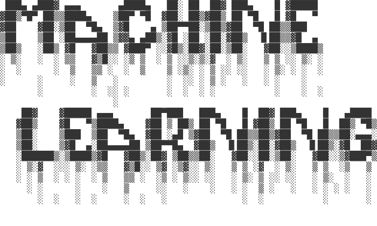
#AI/MachineLearning #HCMUS

# [Link PDF File](MachineLearning.pdf)
# Thông tin kỳ thi

Thời gian: 15g40 - 01/07/2024
Phòng thi: E402 (NVC)

# Lecture 0: Introduce to Machine Learning

#AI
#AI/MachineLearning
#AI/MachineLearning/DeepLearning
#AI/MachineLearning/SupervisedLearning
#AI/MachineLearning/UnsupervisedLearning
#AI/MachineLearning/ReinforcementLearning
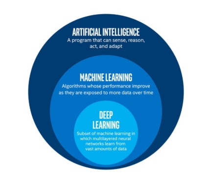

Types of ML (Machine Learning):

1. Supervised learning: have labeled examples of the correct behavior. Dữ liệu có gán nhãn đúng với những gì nó thể hiện
2. Unsupervised learning: no labeled examples - instead, looking for interesting patterns in the data. Ngược lại với Supervised learning, data ko gán nhãn. Do đó, các bài toán liên quan đến Unsupervised là đi tìm các pattern ẩn bên trong data
3. Reinforcement learning: learning system receives a reward signal, tries to learn to maximize the reward signal. Là hệ thống máy học mà nó sẽ học dựa trên các tín hiệu hoặc dữ liệu trong quá trình thực hiện. Ví dụ như huấn luyện bot chơi game,...

# Lecture 1: Linear Regression

#AI/MachineLearning/Regression
#AI/MachineLearning/Regularization
#AI/MachineLearning/SupervisedLearning
#DataMining/DataPreprocessing/Normalization  
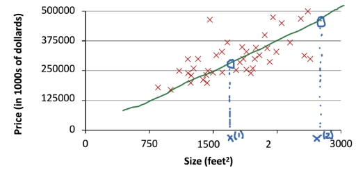

$$y = \theta _0 + \theta_1 x_1 + \theta_2 x_2 + ... + \theta_d x_d = \sum_{j=0}^{d} \theta_j x_j$$
Fit model by minimizing sum of squared errors

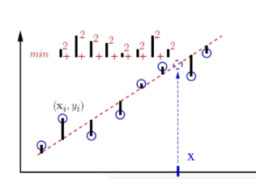

Cost Function:

$$J(\theta) = \frac{1}{2n} \sum_{i=1}^{n} (h_{\theta} (x^{(i)}) - y^{(i)})^2$$

## Gradient descent

1. Choose initial value for $\theta$
2. Until we reach the minimum, update $\theta$ to reduce $J(\theta)$  
   $$\theta_j = \theta_j - \alpha (\frac{\partial}{\partial \theta_j} J(\theta))$$
   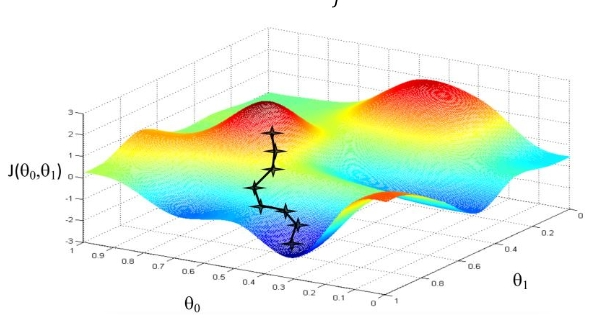

$\alpha$ được gọi là _learning rate_ và thường giá trị của nó nhỏ. Đây là một trong những _hyperparameter_ phổ biến nhất.

## Gradient Descent Variants

Có 3 loại là:

### 1. Batch gradient descent

Thuật toán sẽ tính toán dựa vào toàn bộ dataset ban đầu. GD (Gradient descent) chỉ cập nhật đúng một lần.

Thuật toán sẽ hội tụ đến global minimum (với hàm lồi) và local minimum (với hàm ko lồi) một cách nhanh nhất nhưng nó ko phù hợp với các hệ thống máy tính nếu đầu vào dữ liệu lớn (lớn hơn RAM hiện có)

### 2. Stochastic gradient descent (SGD)

Thuật toán sẽ update với từng data sample, hay nói cách khác là lần lượt một data sample sẽ được đưa vào thuật toán **(Note: phải shuffle data)**.

Ưu điểm là thuật toán sẽ chạy nhanh hơn Batch GD. Phù hợp với online learning (là quá trình học cập nhật từ từ trong ML, mô hình sẽ phải phản ứng và học tập liên tục với từng dữ liệu mới)

Nhược điểm là việc tiến về cực tiểu sẽ khó khăn hơn giá trị của hàm loss function sẽ bị tăng giảm một cách liên tục khó kiểm soát (high variance)

### 3. Mini-batch gradient descent

Đây là thuật toán "nằm ở giữa" hai thuật toán trên. Dữ liệu đưa vào thụât toán sẽ là $k$ data sample

Ưu điểm: giảm variance

Về giá trị $k$, chúng ta sẽ set tùy thuộc vào RAM của máy tính (thường là từ 32 đến 256)

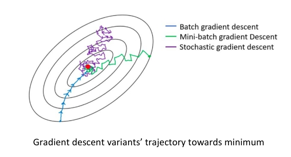
.jpg>)

## Choosing Learning Rate

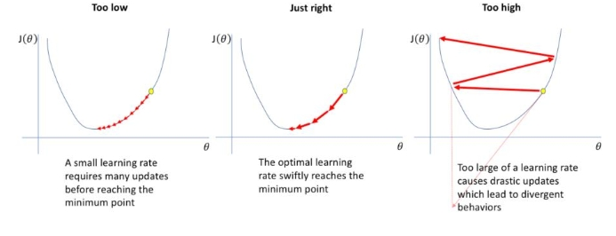

### 1. LR (learning rate) with Exponential Decay

$$\rm LR = LR * exp(- decayRate \times epochNum)$$

### 2. Step Decay

$$\rm LR = LR * dropRate ^ \frac{epoch}{stepSize}$$

## Improved Learning

### 1. Feature Scaling

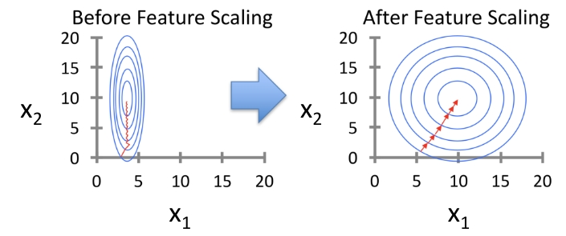

#### 1.1. Standardization

Replace each value with:
$$x_j ^{(i)} := \frac{x_j ^{(i)} - \mu_j}{s_j}$$
Với $\mu_j = \frac{1}{n} \sum_{i=1}^{n} x_j ^{(i)}$ và $s_j = \sqrt{\frac{\sum_{i=1}^{n} |x_j ^{(i)} - \mu_j|}{n}}$

#### 1.2. Min-max scaling

$$x := \frac{x-min(x)}{max(x)-min(x)} $$
Trả ra $x$ thuộc $[0, 1]$

#### 1.3. Mean scaling

$$x := \frac{x-mean(x)}{max(x)-min(x)}$$
Trả ra $x$ thuộc $[-1, 1]$

#### 1.4. Unit vector

$$x := \frac{x}{||x||}$$
Thường dùng để scale ảnh

## Quality of Fit

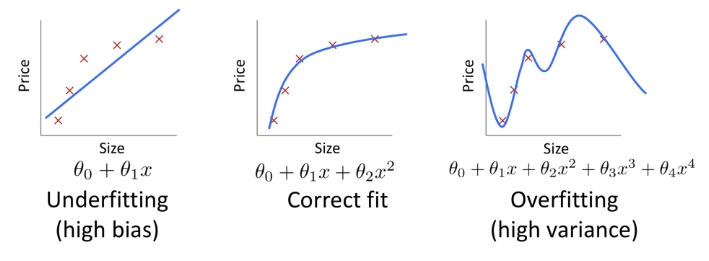

## Regularization

Phương pháp giúp tự động control độ phức phức tạp của learned hypothesis
Ý tưởng: penalize những $\theta_j$ lớn

Thêm vào loss function một lượng $\frac{\lambda}{2} \sum_{j=1}^{d} \theta_j ^2$

$$J(\theta) = \frac{1}{2n} \sum_{i=1}^{n} (h_{\theta} (x^{(i)}) - y^{(i)})^2 + \frac{\lambda}{2} \sum_{j=1}^{d} \theta_j ^2$$

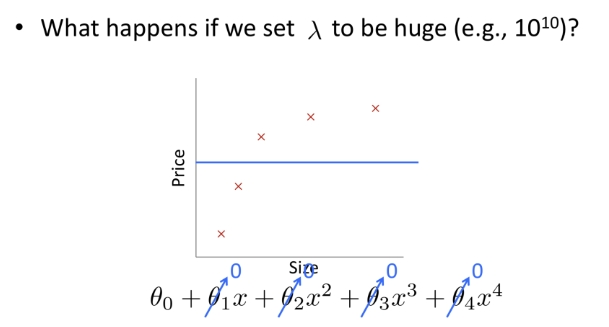

# Lecture 2: Logistic Regression

#AI/MachineLearning/Classification
#AI/MachineLearning/SupervisedLearning
#AI/MachineLearning/Metrics

Đây là thuật toán dùng cho mục đích Classification (Binary hoặc Multi-class classification)

Thuật toán sẽ phân loại dựa trên Xác suất, tức thay vì predict data sample đó thuộc class nào, thuật toán sẽ trả ra xác suất data sample đó thuộc về class nhất định.

Logistic Regression thực ra là Linear Regression được bọc bởi một hàm có khả năng phân loại dữ liệu.

$$h_{\theta} = g(\theta^T x), g(z) = \frac{1}{1+e^{-z}}$$
Và $0 \leq h_{\theta}(x) \leq 1$

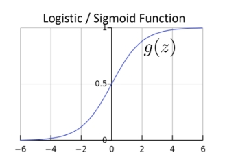

## Loss Function

$$J(\theta) = \begin{cases} -\log(h_{\theta}(x)) \quad \text{if} \quad y = 1 \\ -\log(1 - h_{\theta}(x)) \quad \text{if} \quad y = 0 \end{cases}$$
Việc thêm hàm $\log$ vào giúp mô hình penalize những trường hợp predict sai.

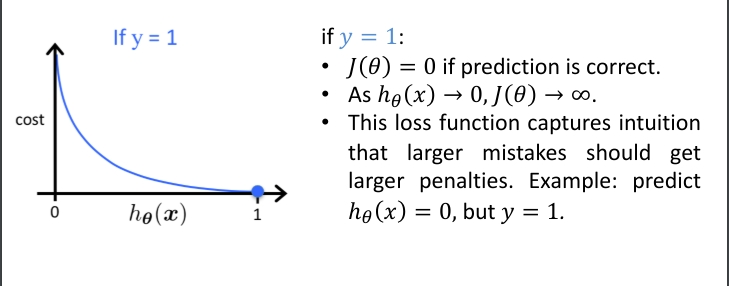

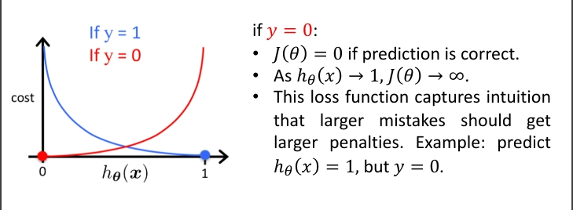

Suy ra Loss Function cho toàn bộ dataset

$$J(\theta) = \frac{-1}{m} \sum_{i=1}^{m} [y^{(i)} \log(h_{\theta}(x^{(i)})) + (1 - y^{(i)}) \log(1 - h_{\theta}(x^{(i)}))]$$
Tương tự như Linear Regression, ta cũng thêm đại lượng $\lambda \sum_{j=1}^{d} \theta_j ^2$ để Regularization

## Multi-class classification

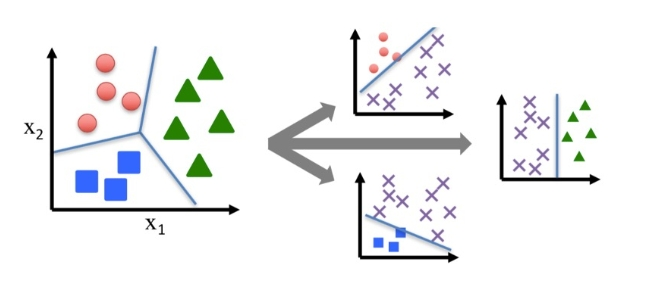

## Softmax

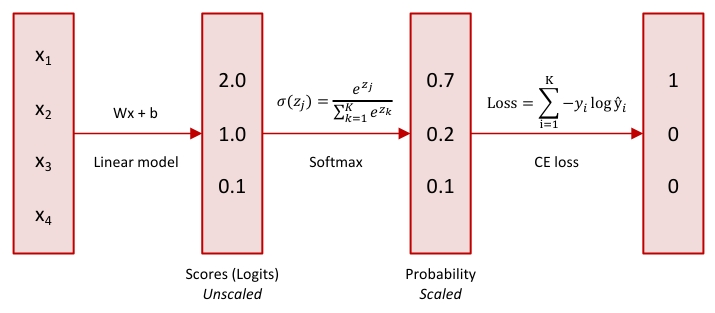

## Metrics

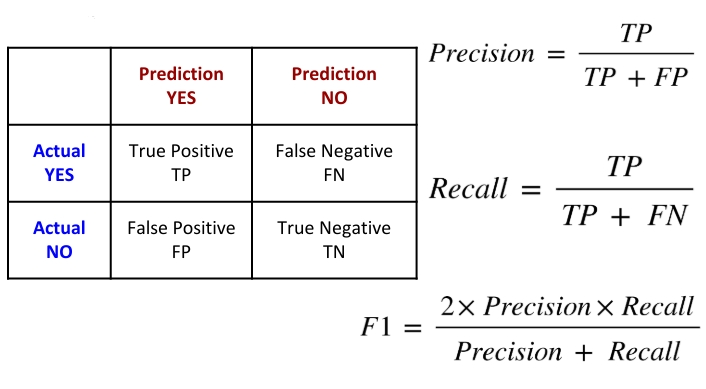

# Lecture 3: Naive Bayes Classification

#Statistic/BayesTheorem
#AI/MachineLearning/Classification
#AI/MachineLearning/SupervisedLearning

![[naivebayes_pipeline.jpg]]

Chữ "naive" có ý nghĩa giả định sự xuất hiện của một feature đang xét là độc lập với sự xuất hiện của các feature khác

![[example_naivebayes.jpg]]

## Bayes Theorem

$$P(A|B) = \frac{P(B|A) \times P(A)}{P(B)}$$
Trong đó: $P(A|B)$ là xác suất xuât hiện của $A$ được cho trước bởi sự kiện $B$

Ví dụ về Bayes Theorem: Tính xác suất của một lá bài Queen được cho bởi Face (là bài hình)

- Without Bayes Theorem:
  $$P(Queen|Face) = \frac{4}{12} = \frac{1}{3}$$
- With Bayes Theorem:
  $$P(Queen|Face) = \frac{P(Face|Queen) \times P(Queen)}{P(Face)} = \frac{1 + \frac{4}{52}}{\frac{12}{52}} = \frac{1}{3}$$

## Bayes Theorem for Naive Bayes Classifier

Bài toán như sau:

- Features: $\{ x_1, x_2, ..., x_n\}$
- Classes: $\{ C_1, C_2, ..., C_3\}$
  Mục tiêu: Tính xác suất điều kiện của một data sample mới với các feature $\{x_1, ..., x_n\}$ thuộc vào class $C_i$ nào

$$P(C_i|x_1, x_2, ..., x_n) = \frac{P(x_1, x_2, ..., x_n|C_i) \times P(C_i) }{P(x_1, x_2, ..., x_n)},  \forall 1 \leq i \leq k$$
trong đó: $P(x_1, x_2, ..., x_n) = P(x_1 \cap x_2 \cap ... \cap x_n)$

Thực tế, việc collect dữ liêu cho $P(x_1, ..., x_n|C_i)$ và $P(x_1, ..., x_n)$ rất khó khăn. Do đó, chúng ta sẽ sử dụng các feature độc lập với nhau.
Khi đó, $$P(A, B) = P(A) \times P(B)$$ nếu $A, B$ độc lập.
Suy ra: $P(A,B|C) = P(A|C) \times P(B|C)$

Suy ra $$P(C_i|x_1, x_2, ..., x_n) = \frac{P(x_1, x_2, ..., x_n|C_i) \times P(C_i) }{P(x_1, x_2, ..., x_n)} = \frac{P(C_i) \prod_{m=1}^{n}P(x_m|C_i)}{P(x_1, ..., x_n)}$$
Và class ta cần tìm sẽ là:

$$class = \text{argmax}_{C_i} P(C_i) \prod_{m=1}^{n}P(x_m|C_i)$$

## Ví dụ

**_(Lưu ý: Phần tính toán có ra thi)_**

Đề bài:
![[example_hand_calculate_NB.jpg]]

Đếm các feature theo bảng bên phải chia cho số lượng data sample

![[example_hand_calculate_NB (1).jpg]]

Sau đấy, dùng công thức Bayes, tính ra xác suất đi chơi (hoặc không đi chơi) dựa vào feature của một data sample mới

![[example_hand_calculate_NB (2).jpg]]

Suy ra:
$$P(Yes|x') = 0.0053 < 0.0206 = P(No|x')$$
Suy ra Label của $x'$ là **No**

## Gaussian Naive Bayes

Đây là phần dành cho các feature liên tục (Continuous-valued Features). Ví dụ: Nhiệt độ, áp suất, lượng mưa theo giờ,...

Ta sẽ sử dụng công thức xác suất tuân theo phân phối chuẩn là

$$P(x_i|y) = \frac{1}{\sqrt{2\pi \sigma^2_y}} \times \text{exp}(\frac{-(x_i - \mu_y) ^ 2}{2 \sigma ^2 _y})$$
![[example_contiuous_value_NB.jpg]]

## Laplace Smoothing

Đây là phương pháp giúp tránh trường hợp trong quá trình training, chúng ta tính xác suất bằng 0 với một thuộc tính nhất định, từ đó dẫn đến khi áp dụng công thức Bayes sẽ ra bằng 0 trong mọi data sample mới có cùng thuộc tính. Gây ra tình trạng **overfitting**

Các fix như sau:

Với $P(X=x_i|C=c_j) = \frac{m_i}{n_j}$

Thì ta sẽ: $$P(X=x_i|C=c_j) = \frac{m_i + 1}{n_j + |values(X)|}$$
với

- $m_i$ là số data sample có giá trị $x_i$ tại thuộc tính $X$ và thuộc lớp $c_j$
- $n_j$ là số lượng data sample thuộc lớp $c_j$
- $|values(X)|$ là số lượng unique value tại feature $X$

## Log-probability

Trong thực tế, việc các xác suất rất nhỏ xảy ra là chuyện bình thường và trong công thức ta rút ra ở trên, ta phải nhân chúng lại với nhau, gây ra hiện tương underflow. Dẫn đến máy tính không thể tính toán chính xác các giá trị này và gây ra hiện tương sai số.

Do đó, ta cần biến đổi công thức xác định class một chút:

$$
class = \text{argmax}_{C_i} P(C_i) \prod_{m=1}^{n}P(x_m|C_i) =
\text{argmax}_{C_i} \log P(C_i) + \sum_{m=1}^{n}\log P(x_m|C_i)
$$

## Summary

Ưu điểm:

- Train nhanh
- Predict nhanh
- Không nhạy cảm với các đặc trưng không liên quan
- Xử lý tốt với cả dữ liệu liên tục và rời rạc
- Xử lý tốt với streaming data
- Tính giải thích rất tốt
  Nhược điểm:
- Chỉ hoạt động tốt với các feature độc lập lẫn nhau

# Lecture 4: Decision Tree & Random Forest

#AI/MachineLearning/Classification
#AI/MachineLearning/Regression
#AI/MachineLearning/SupervisedLearning
#AI/Algorithm
#DataMining/DataPreprocessing/FeatureExtraction

Decision Tree là thuật toán dựa vào cấu trúc cây.

```{code}
node = Root
examples = Training Set
Split ( node, {examples} ):
	1. Find A, the best attribute for splitting the {examples}
	2. Create decision nodes for attribute A (i.e., child nodes
	of node)
	3. Split training {examples} to child nodes
	4. If examples perfectly classified (subset is pure):
			STOP
		else: iterate over new child nodes
			Split (child_node, {subset of examples} )
```

Giải nghĩa _"subset is pure"_:

![[example_puresubset.jpg]]

Như hình vẽ, ta thấy việc chọn Outlook feature tạo ra một nhánh đi theo value Overcast giúp predict một cách hoàn hảo (completely certain 100%). Suy ra Outlook là pure subset

## Entropy

$$H(S) = -(p_{(+)} \log p_{(+)} + p_{(-)} \log p_{(-)})$$

- Impure (3 yes / 3 no)
  $$H(S) = - \frac{3}{6} \log{\frac{3}{6}} - \frac{3}{6} \log{\frac{3}{6}} = 1$$
- Pure (4 yes / 0 no)
  $$H(S) = - \frac{4}{4} \log{\frac{4}{4}} - \frac{0}{4} \log{\frac{0}{4}} 0$$

## Information Gain

Đây là công thức giúp xác định xem đâu là feature phù hợp nhất để làm node

$$Gain(S, A) = H(S) - \sum_{V \in Values(A)} \frac{|S_v|}{|S|} H(S_v)$$
Ví dụ;

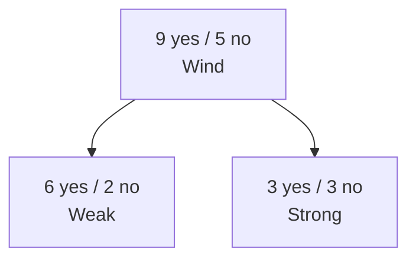

$$Gain(S, Wind) = H(S) - \frac{8}{14} H(S_{Weak}) - \frac{6}{14} H(S_{Strong})$$$$= 0.94 - \frac{8}{14}*0.81 - \frac{6}{14}*1 = 0.049$$
Ta sẽ chọn feature nào có gía trị $Gain(S, A)$ cao nhất

Có một vấn đề khá lớn với với Information Gain là:

![[problem_gain.jpg]]
Để tránh tình trạng này xảy ra, ta sẽ sử dụng GainRatio

$$SplitEntropy(S,A) = - \sum_{V \in Values(A)} \frac{|S_v|}{|S|} \log \frac{|S_v|}{|S|}$$
$$GainRatio(S, A) = \frac{Gain(S, A)}{SplitEntropy(S,A)}$$

## Avoid Overfitting for Decision Tree

1. Dừng việc phát triền cây khi dữ liệu bị split không còn ý nghĩa
2. Loại bỏ các thuộc tính không liên quan
3. Sử dụng Post-prunning

Post-prunning cho phép cây phân loại hoàn toàn tập huấn luyện rồi mới cắt tỉa

Pre-prunning dừng việc phát triển cây sớm hơn, trước khi nó hoàn toàn phân chia tập dữ liệu

## Continuous Variables

Các bước để xử lý trường hợp biến liên tục

1. Sort value of feature, kể cả class labels
2. Chọn cut point (sử dụng information gain để chọn)

Ví dụ:

![[example_contiuous_value_DT.jpg]]

## Multi-class Classification

Sử dụng công thức Entropy cho Multi-class

$$H(S) = - \sum_{c} p_c \log (p_c)$$

## Random Forest

Training: grow K different decision trees:

- Pick a random subset $S_{random}$ of training examples.
- Grow a full decision tree (no pruning), compute
  information gain based on $S_{random}$ instead of full set.
- Repeat for K decision trees.

Inference: given a new data point X:

- Classify X using each of the K trees.
- Use majority vote: class predicted most often.

Fast, scalable, state-of-the-art performance.

## Gini impurity

### 1. Gini impurity of a dataset

$$Gini(D) = \sum_{i=1}^{k} p_i(1-p_i) = 1 - \sum_{i=1}^k p_i^2$$
![[gini_dataset.jpg]]

$Gini = 0 \implies$ **Pure**
$Gini = 0.5 \implies$ **Equal**
$Gini = 1 \implies$ **Random**

2. Gini impurity of an attribute

$$Gini_A(D) = \sum_{s=1}^{m} \frac{|D_s|}{|D|} Gini(D_s)$$
Chọn attribute có Gini impurity bé nhất để chia

![[gini_attribute.jpg]]

3. Gini information gain

$$\Delta Gini(A) = Gini(D) - Gini_A(D)$$
Chọn attribute có Gini information gain cao nhất để split

$$\Delta Gini(Outlook) = 0.459 - 0.343 = 0.116$$
$$\Delta Gini(Wind) = 0.459 - 0.429 = 0.03$$
=> Outlook is chosen

## Regression Tree

Idea: Tìm best point để split dataset thành 2 phân sao cho MSE nhỏ nhất tại điểm đó

Steps:

1. **Sort** data dựa vào feature
2. **Brute-force** tất cả các điểm có thể chia, tính MSE
3. **Choose** minimum MSE, từ đó chọn được best point

![[example_MSE_regressionTree.jpg]]

## Feature Importance - A single decision tree

Idea: Tính số điểm "importance" của từng data feature. Điểm càng cao thì độ ảnh hưởng của feature đó càng lớn

$$I_i = \sum_{i_n = i} [p(n) purity(n) - \sum_{n_{child}} p(n_{child}) purity(n_{child})]$$

$purity(n)$ ở đây có thể dùng Entropy, Gini hay Squared Error để tính

Ví dụ:
![[feature_import_DT.jpg]]

$$\text{satisfaction\_level} = \frac{18282}{18282} *1 - \frac{7831}{18282} * 0.649 - \frac{10451}{18282}*0.811 = 0.2584$$
$$\text{time\_spend\_company} = (\frac{7831}{18282}*0.649 - \frac{7129}{18282}*0.508 - \frac{702}{18282}*0.866) $$$$ + (\frac{10451}{18282}*0.811 - \frac{7242}{18282}*0.221 - \frac{3209}{18282}\*0.835) = 0.2761$$

Tương tự cho Gini, chỉ cần thay đổi giá trị $purity(n)$

## Feature Importance - Random Forest

Idea: Tính điểm Importance of Feature I trên từng cây đơn rồi cộng lại chia số cây.

$$I_i = \frac{1}{|B|} \sum_{T \in B} I_i(T)$$

# Lecture 5: K-Means Clustering

#AI/MachineLearning/UnsupervisedLearning
#AI/MachineLearning/Clustering

## Unsupervised Learning

Dữ liệu đầu vào chỉ có các feature ($\overline{X}$), không hề có label ($Y$) như supervised learning

Advantage: không cần mất thời gian và tiền bạc để đánh nhãn dữ liệu

Challenge: mục tiêu không còn đơn giản chỉ là predict

Ví dụ: Phân loại bệnh theo biểu hiện gene, chia nhóm người mua sắm dựa vào các đặc trưng mua hàng, ....

## Clustering

Clustering là kỹ thuật tìm **subgroups** in a dataset. Mục tiêu là chia dữ liệu thành các tập riêng biệt dựa vào đặc trưng của từng data sample.

Từ đó đưa ra kết luận là 2 hay nhiều data sample là giống hay khác nhau dựa trên mục đích

![[ex_clustering.jpg]]

## K-Means Clustering

### Định nghĩa

$C_1, ..., C_k$ là các cluster, chúng được xác định dựa vào 2 điều kiện sau:

1. $C_1 \cup C_2 \cup ... \cup C_k = \{ 1, ..., n\}$ (tức bất kỳ data sample nào cũng thuộc 1 cluster)
2. $C_k \cap C_{k'} \ = \varnothing, \forall k \ne k'$, (tức ko cluster nào bị overlap)
   For instance, một data sample thuộc về 1 cluster

### Mục tiêu

K-Means clustering càng tốt khi **within-cluster variation** càng nhỏ.
$WCV(C_k)$ là giá trị khoảng cách của các data sample thuộc cùng 1 cluster.

Suy ra, mục tiêu của K-Means Clustering là

$$\rm minimize \{ \sum_{i=1}^k WCV(C_i) \}$$
Nếu chúng ta sử dụng công thức khoảng cách là Euclidean thì

$$WCV(C_k) = \frac{1}{|C_k|} \sum_{i, i' \in C_k} \sum_{j=1}^p (x_{ij} - x_{i'j})^2$$
Với $|C_k|$ là số lượng data sample (hay observations) trong 1 cluster thứ $k$

### Thụât toán

1. Random đánh số cluster cho từng observation từ 1 đến $k$
2. Lặp cho tới khi các cluster không còn thay đổi
   2.1. Với mỗi $k$ clusters, tìm centroid. Centroid của cluster là vector các trung bình cộng các feature thuộc về observation (quan sát) trong cluster
   2.2. Đánh số cluster của observation dựa vào khoảng cách ngắn nhất đến centroid của từng cluster.

### Chọn $k$ cho phù hợp

- Áp dụng thụât toán cho các giá trị $k$ khác nhau, ví dụ: 1 đến 10
- Với mỗi $k$, tính $WCV$
- **Plot the curve** của $WVC$ so với $k$
- Chọn $k$ là điểm có sự giảm ở lần tiếp theo không đáng kể so với lần giảm trước đó.

![[elbow_kmeans.jpg]]

## Hierarchical Clustering

Khác với K-Means Clustering, thuật toán Hierarchical Clustering cần phải xác định giá trị $k$ trước. Đây có thể là một nhược điểm

Trong section này, ta sẽ tìm hiểu **bottom-up** hoặc **agglomerative clustering**

### Thuật toán

1. Set từng điểm là một cluster riêng biệt
2. Xác định cặp cluster gần nhất và merge chúng
3. Lặp lại cho tới khi toàn bộ điểm thuộc về một cluster

![[ex_hierarchical.jpg]]

Sau đó, ta chọn $k$ phù hợp bằng cách kẻ một đường trên dendogram

![[ex_dendogram.jpg]]

### Linkage

Ta sẽ tìm hiểu cách để tính khoảng cách của các cluster. Bởi vì một cluster sẽ có nhiều point nên sẽ có nhiều cách tính chẳng hạn như:

- Single Link

![[single_link.jpg]]

- Complete link

![[complete_link.jpg]]

- Average link

![[average_link.jpg]]

- Centroid link

![[centroid_link.jpg]]

Cùng so sánh 4 loại linkage nhé

![[compare_linkage.jpg]]

**Lưu ý**: xác định khoảng cách giữa các cluster xong rồi mới dựa vào khoảng cách đó để tìm đâu là cluster nào gần nhất (khoảng cách vừa tính được nhỏ nhất). Tránh nhầm lẫn

# Lecture 06: Support Vector Machine (SVM)

#AI/MachineLearning/Classification
#AI/MachineLearning/SupervisedLearning

## Introduce

Đây là thuật toán Classification (Supervised Learning), và sẽ đi tìm global optimum (not a local optimum)

SVM là một trong những model hiệu quả nhất về classification problem. Đặc biệt, model xử lý binary classification (về multiclass thì sử dụng phương pháp One-vs-All)

![[ex_svm.jpg]]

Nhìn vào hình, ta có thể thấy ko chỉ đường kẻ ấy là đường duy nhất có thể chia tách dữ liệu. Thế thì đường nào mới là đường tối ưu

![[svm_line_optimal.jpg]]

Các training sample nằm trên đường biên (margin line) được gọi là **support vectors** nhằm định hướng optimal hyperplane (siêu phẳng tối ưu)

Optimal hyperplane là hyperplane có khoảng cách giữa margin line lớn nhất

Gọi $M$ là khoảng cách giữa hai margin line.
Chọn $x^-$ sao cho $f(x^-) = -1$, $x^+$ sao cho $f(x^+) = 1$

Suy ra ta có
$$\begin{cases} wx^+ + b = 1 \\ wx^- + b = -1 \end{cases}$$

$$\implies w(x^+ - x^-) = 2 \implies M = \frac{2}{||w||}$$

Suy ra $$\rm argmax M = argmax \frac{2}{||w||} = argmin \frac{||w||}{2} = argmin \frac{1}{2} ||w||^2$$ với ràng buộc $$\begin{cases} y^{(i)} = 1 \to wx^{(i)} + b \geq 1 \\ y^{(i)} = -1 \to wx^{(i)} + b \leq -1 \end{cases}$$

Suy ra:

$$\rm argmin \frac{1}{2} ||w||^2 \quad \text{with constraint} \quad y^{(i)}(wx^{(i)} + b) \geq 1$$

## Exercise: Optimization Problem

Find $\text{argmin} f(x, y) = x^2 + y^2$ với $g(x, y) = x+y=1$

_High school Solution_

$y = 1-x \implies f(x) = x^2 + (1-x)^2 = 2x^2 - 2x + 1$

$$f'(x) = 4x - 2 = 0 \implies x = \frac{1}{2} = y$$

_University Solution_

Ta sẽ sử dụng nhân tử Lagrange
$$\begin{cases} \nabla f(X) = \sum_{i=1}^n \lambda_i \nabla g_i(X) \\ g_i(X) = k_i \end{cases}$$

$$\begin{cases} \nabla f(x, y) = \lambda \nabla g(x, y) \\ x + y = 1 \end{cases}$$
$$\implies \begin{cases} \Big< \frac{\partial f}{\partial x} , \frac{\partial f}{\partial y}\Big> = \Big< \lambda \frac{\partial g}{\partial x} , \lambda \frac{\partial g}{\partial y}\Big> \\ x + y = 1 \end{cases}$$
$$\implies \begin{cases} \Big< 2x, 2y \Big> = \Big< \lambda,  \lambda \Big> \\ x + y = 1 \end{cases}$$
$$\implies \begin{cases} x = \frac{\lambda}{2} \\ x = \frac{\lambda}{2} \\ x + y = 1 \end{cases}$$
$$\implies \begin{cases} x = \frac{1}{2} \\ y = \frac{1}{2} \\ \lambda = 1 \end{cases}$$
$$\implies f_{min}(\frac{1}{2}, \frac{1}{2}) = \frac{1}{2}$$

## Karush-Kuhn-Tucker (KTT, inequality constraint)
